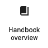
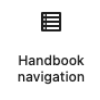
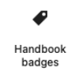
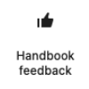

# Blocks

Living Handbook ships ten dynamic blocks, grouped under the **Living Handbook** category in the block inserter. They are server-rendered: each one builds its markup on page load from the current context. Most only output something in the context they are meant for; placed anywhere else they render nothing at all.


## The three surfaces

Before the individual blocks, it helps to know the three pages a handbook has. Almost every block belongs to exactly one of them.

| Surface | What it is | URL |
| --- | --- | --- |
| **Overview** | Lists all handbooks a visitor may read. A normal WordPress page that you create yourself and put the overview block on. | Whatever you choose, for example `/handbook/` |
| **Entry page** | The start page of one handbook: search, filters, areas, recently updated. Created automatically for every handbook. | `/handbook-set/<handbook-slug>/` |
| **Single page** | One handbook page: navigation, content, table of contents, badges, feedback, metadata. | `/handbook/<page-slug>/` |

The entry page and the single page come with block templates that already place the right blocks, so you rarely need to build them by hand. The overview is the exception: **the plugin does not create it for you.** Create a normal page, add the "Handbook overview" block, publish, and that page is your overview. There is deliberately no automatic archive at `/handbook/`, because that would be a second, competing overview you cannot style.

## Handbook overview (`living-handbook/overview`)



Lists every handbook the current visitor may read: name, description and page count, each linking to that handbook's entry page. Handbooks the visitor may not read are left out entirely.

**Settings:** *Display* switches between **List** (default) and **Cards**. A list reads better for the handful of handbooks most sites have; cards suit a page where the overview is the main visual element.

**Renders on:** any page or template you place it on. Unlike the other blocks it does not need a special context.

## Handbook entry (`living-handbook/entry`)


The start page of one handbook. It shows a prominent search field, the areas of the handbook (its top-level pages, with a subpage count) and the most recently updated pages, plus a facet filter (page type, area, responsible role, audience).

Selecting a facet or submitting the search filters the list without reloading the page, so there is no separate "Filter" button. If JavaScript is unavailable, the search still works as a normal form submit.

**Settings:** *Display* switches the cards between **Cards** (default) and **List**.

**Renders on:** a handbook entry page only (the `handbook_set` term archive, for example `/handbook-set/general/`), placed by the "Handbook entry" template. It reads which handbook to show from the URL, so it outputs nothing anywhere else.

## Handbook menu (`living-handbook/menu`)

A compact list of the handbooks the visitor may read, meant for a site header or a navigation area. On narrow screens it collapses behind a toggle button. Like the overview, it only lists handbooks the visitor is allowed to see.

**Renders on:** anywhere. It is the one block designed to sit outside the handbook itself.

### Putting the handbooks into your theme's navigation

Often you do not want a separate block, you want the handbooks inside the theme's own menu, so they ride along in the mobile hamburger. The plugin can inject them into a core **Navigation** block for you.

You mark the target with the CSS class **`has-handbook-menu`**.

**Where to type it:** select the block in the editor. In the right-hand sidebar, open the **Settings** tab (the gear). Scroll to the bottom of that tab, past the block's own fields, and expand the collapsed **Advanced** panel. Enter `has-handbook-menu` in **Additional CSS class(es)**, then save. The panel is easy to miss because it sits below everything else.

There are three places you can put that class, and they behave differently:

1. **On a single navigation link (recommended).** The link turns into a submenu whose children are the handbooks. It keeps its own label and its own destination, so a link labelled "Handbook" pointing at your overview page still works when clicked, and opens the handbook list as a submenu.
2. **On a navigation submenu.** The submenu's children become the handbooks. It keeps its own label and link, so you decide what it is called and where it points. Use this if you already have a submenu in place. It also works for a submenu nested inside another submenu, and for one that is still empty.
3. **On the whole Navigation block.** A submenu labelled "Handbooks" is added as the first item. Change the label with the `living_handbook_nav_label` filter (see [hooks.md](hooks.md)).

Recommendation: use option 1 or 2. Both keep a working parent link that you control. Option 3 has no sensible destination for its parent item, because there is no automatic handbook archive to point at.

**This only works with the block Navigation.** The classic menu editor under Appearance → Menus is not touched, so a CSS class entered there has no effect.

Two more caveats. The injection reproduces the markup of the core Navigation block, so a future WordPress release could change that markup and require an adjustment. And the handbook list is built per visitor, because it depends on who may read what, which is why it cannot simply be a static menu you edit by hand.

## Handbook navigation (`living-handbook/navigation`)



The page tree of the current handbook, output as a core Navigation block carrying a VSN block style. The tree is scoped to the current handbook, so it never lists pages of another one, and the assembled markup is cached per handbook (and rebuilt when a page or handbook changes). The current page is marked automatically.

**Settings:** *Display* chooses between **Menu** (`is-style-vsn-sidebar`: parent pages stay clickable links, the path to the current page is open) and **Accordion** (`is-style-vsn-sidebar-accordion`: submenus open on click, one per level; parent items become buttons and are no longer direct links).

**Renders on:** single handbook pages and handbook entry pages. The styling and the open/close behaviour come from the **Vertical Sidebar Navigation (VSN)** plugin; without it you get an unstyled core navigation.

## Handbook badges (`living-handbook/badges`)



The badge row for a single page: page type, area and audience.

**Renders on:** single handbook pages only.

## Table of Contents (`living-handbook/toc`)


A table of contents for the current page. The block outputs an empty, hidden container; a small script fills it from the headings of the content, up to the configured depth, and highlights the current section while you scroll. Clicking an entry jumps to the heading and moves the keyboard focus there, so keyboard and screen-reader users land at the section rather than back at the top. If the page has no headings within the depth, the container stays hidden.

**Settings:** *Placement* (desktop or mobile) and *Heading depth* (H1 to H6). A single page can override the depth in its "Handbook maintenance" meta box.

The templates place two instances: a sticky desktop one in the side column and a mobile one above the content. CSS shows only the one that fits the screen, so you do not have to choose.

**Renders on:** single handbook pages only.

## Handbook feedback (`living-handbook/feedback`)



The "Was this helpful?" prompt with Yes and No buttons. Votes are counted per page, one per user, and only from users who are allowed to read that page. The maintenance dashboard reports the totals.

**Renders on:** single handbook pages only.

## Handbook page meta (`living-handbook/pagemeta`)


The metadata footer of a single page: created, last updated, last reviewed and the responsible role, each with the person (avatar and name) where one is assigned. The review date carries a freshness badge with one of three states:

| Badge | Meaning |
| --- | --- |
| **Reviewed** | The last review is within the page's review interval. |
| **Review due** | The interval has passed. |
| **Unchecked** | Twice the interval has passed, the escalation state. |

**Settings:** *Show people* toggles the avatar and name.

**Renders on:** single handbook pages only.

## Mermaid diagram (`living-handbook/mermaid`)


Renders a diagram written in [Mermaid](https://mermaid.js.org/) syntax, drawn in the browser. The import creates this block automatically from a ```` ```mermaid ```` code fence; you can also insert it by hand and paste the diagram source. Unlike the other blocks it is not context-bound, so it renders wherever you place it, including inside the page content.

## GitHub source note (`living-handbook/git-source-note`)


A short note marking a page as maintained on GitHub and updated automatically. It only appears on a page whose source is GitHub; on a page maintained in WordPress it renders nothing, so you can place it in the single template once and forget about it.

**Settings:** the note text is editable.

## Nothing shows up?

Three causes account for almost every "the block is empty" report:

- **The page has no handbook.** Access is deliberately fail-closed: a handbook page that is not assigned to a handbook is invisible on the front end. Assign it in the editor sidebar.
- **The handbook is not visible to you.** A new handbook defaults to "All members (logged in)", so logged out you see nothing. Change it on the handbook itself (Handbook → Handbook types → edit).
- **The block is in the wrong context.** Most blocks only render on a single page or an entry page. See "Renders on" above.

## Styling the blocks

All blocks use CSS custom properties and stable class names, so you can restyle them without touching the plugin. The full reference, the `--lh-*` variables, the class names per block, and what not to remove for accessibility, lives in [customization.md](customization.md).
