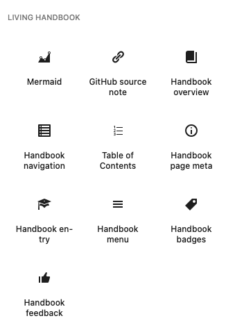
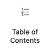
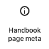
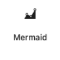

# Blöcke

Living Handbook bringt elf dynamische Blöcke mit, im Block-Einfüger unter der Kategorie **Living Handbook** gruppiert. Sie werden auf dem Server gerendert: jeder baut sein Markup beim Seitenaufruf aus dem aktuellen Zusammenhang. Die meisten geben nur in dem Zusammenhang etwas aus, für den sie gedacht sind; woanders platziert rendern sie gar nichts.

Jeder von ihnen bietet ausserdem einen **HTML-Anker** und eine **zusätzliche CSS-Klasse** im Bereich **Erweitert** des Blocks: der Anker wird zur ID des Wurzelelements, die Klasse wird ihm hinzugefügt. So kannst du direkt auf einen Block verlinken oder eine einzelne Instanz gestalten. Siehe [Anpassung](anpassung.md#klassen).



## Die drei Oberflächen

Vor den einzelnen Blöcken hilft es zu wissen, welche drei Seiten ein Handbuch hat. Fast jeder Block gehört zu genau einer davon.

| Oberfläche | Was sie ist | URL |
| --- | --- | --- |
| **Übersicht** | Listet alle Handbücher, die eine Person lesen darf. Eine gewöhnliche WordPress-Seite mit dem Übersichts-Block; die Aktivierung legt dir eine an, und du kannst sie verschieben, umgestalten oder ersetzen. | Was du wählst, zum Beispiel `/handbook/` |
| **Einstiegsseite** | Die Startseite eines Handbuchs: Suche, Filter, Bereiche, zuletzt geändert. Wird für jedes Handbuch automatisch erzeugt. | `/handbook-set/<handbuch-slug>/` |
| **Einzelseite** | Eine Handbuchseite: Navigation, Inhalt, Inhaltsverzeichnis, Abzeichen, Feedback, Metadaten. | `/handbook/<seiten-slug>/` |

Die Einstiegsseite und die Einzelseite kommen mit Block-Templates, die die richtigen Blöcke bereits setzen, du musst sie also selten von Hand bauen. Die Übersicht ist eine gewöhnliche Seite: die Aktivierung legt eine namens „Handbuch" an, mit dem Block „Handbuch-Übersicht" bereits darauf, damit eine frische Installation etwas zeigt statt nichts. Weil es eine gewöhnliche Seite ist, kannst du sie verschieben, umgestalten oder durch eine eigene ersetzen. Ein automatisches Archiv unter `/handbook/` gibt es bewusst nicht, denn das wäre eine zweite, konkurrierende Übersicht, die du nicht gestalten kannst.

## Handbuch-Übersicht (`living-handbook/overview`)


Listet jedes Handbuch, das die aktuell besuchende Person lesen darf: Name, Beschreibung und Seitenzahl, jeweils verlinkt auf die Einstiegsseite dieses Handbuchs. Handbücher, die sie nicht lesen darf, fehlen vollständig.

Darunter stehen die ersten Seitentitel, und die sind es, die zwei Handbücher unterscheidbar machen: Name und Seitenzahl sagen, wie ein Handbuch heisst und wie gross es ist, nicht was darin steht. Ein Link „Alle Seiten" erscheint genau dann, wenn es mehr gibt als gezeigt wird.

Ein Handbuch, das zu einem anderen gehört, steht eingerückt darunter und nennt es („in Firma"). Die Gruppierungs-Taxonomie ist seit ihrer Registrierung hierarchisch, gelesen hat das niemand, eine gebaute Struktur war also bis 0.68.0 unsichtbar. Drei Regeln gehören dazu, alle bewusst: **Zugriff wird nicht vererbt**, jedes Handbuch entscheidet für sich, wer es lesen darf; ein Kind, dessen Elternteil die Besucherin nicht sehen darf, rückt auf die oberste Ebene statt mit ihm zu verschwinden, denn sonst gäbe es ein lesbares Handbuch, das niemand erreicht; und die Reihenfolge innerhalb einer Ebene ist der Name.

**Einstellungen:** *Darstellung* wechselt zwischen **Liste** (Standard) und **Karten**. Eine Liste liest sich besser für die Handvoll Handbücher, die die meisten Websites haben; Karten passen auf eine Seite, auf der die Übersicht das tragende visuelle Element ist. *Seitentitel pro Handbuch* ist die Länge der Vorschau, 0 bis 10, standardmässig drei; 0 schaltet sie ab.

**Rendert auf:** jeder Seite oder jedem Template, auf das du ihn setzt. Anders als die übrigen Blöcke braucht er keinen besonderen Zusammenhang.

## Die Einstiegsseite besteht aus drei Blöcken

Eine Einstiegsseite hat drei Teile, und seit 0.66.0 ist jeder ein eigener Block: die **Suchleiste**, die **Ergebnisspalte** (der Eintrags-Block) und die **Filterleiste**. Das mitgelieferte Template „Handbuch-Einstieg" enthält alle drei, eine frische Installation sieht also aus wie zuvor; im Editor siehst du die Teile jetzt, kannst sie verschieben oder einen weglassen.

Vor 0.66.0 zeichnete der Eintrags-Block alle drei selbst, und 0.65.0 gab ihm zwei Schalter, um Suchleiste und Filterleiste abzuschalten. Beide sind weg: eine Einstellung, die eine Schwäche verwaltet, ist schlechter als keine Schwäche. Was gesetzt ist, wird gezeichnet.

Die drei finden einander über die Handbuch-ID an der Ergebnisspalte, Suchleiste und Filterleiste wirken also unabhängig davon, wo auf der Seite sie stehen.

## Handbuch-Einstieg, Ergebnisse (`living-handbook/entry`)


Die Ergebnisspalte der Startseite eines Handbuchs: die Bereiche des Handbuchs (seine Seiten oberster Ebene, mit der Zahl der Unterseiten) und die zuletzt geänderten Seiten, oder die passenden Seiten, solange eine Suche oder ein Filter aktiv ist.

**Einstellungen:** *Darstellung* wechselt zwischen **Karten** (Standard) und **Liste**.

**Rendert auf:** nur auf einer Handbuch-Einstiegsseite (dem Term-Archiv von `handbook_set`, zum Beispiel `/handbook-set/allgemein/`). Er liest aus der URL, welches Handbuch gemeint ist, und gibt darum sonst nirgends etwas aus.

## Handbuch-Suche (`living-handbook/search-form`)

Die Suchleiste eines Handbuchs. Sie sucht im Handbuch und grenzt die Ergebnisspalte ein; die gesetzten Facetten reisen als versteckte Felder mit, damit eine Suche die Filter nicht stillschweigend verwirft. Mit JavaScript aktualisiert sich die Spalte beim Tippen, ohne wird das Formular abgeschickt und die Seite lädt mit der Suche in der URL neu.

**Einstellungen:** *Beschriftung anzeigen* samt Wortlaut, Platzhaltertext, Aufschrift der Schaltfläche und deren Position (neben dem Feld, im Feld, oder keine). Ohne Schaltfläche sucht die Eingabetaste. Die Beschriftung steht in jedem Fall im Dokument: ein Suchfeld mit blossem Platzhalter verliert seinen zugänglichen Namen, sobald etwas hineingeschrieben wird.

Farben, Rahmen, Schrift und Abstände sind keine Einstellungen dieses Blocks, sondern seine `supports` in der Seitenleiste, dieselben, die die Kern-Blöcke nutzen. Was der Kern-Suchblock hat und dieser nicht, ist die ausklappbare Variante; sie bleibt weg, bis jemand sie verlangt.

**Rendert auf:** einer Handbuch-Einstiegsseite und einer Einzelseite (dort sucht sie im Handbuch dieser Seite).

## Handbuch-Filterleiste (`living-handbook/filters`)

Der Facettenfilter eines Handbuchs als eigener Block: Seitentyp, Thema, verantwortliche Rolle, Zielgruppe. Angeboten wird nur, was die Seiten dieses Handbuchs wirklich tragen; solange nichts gesetzt ist, bleibt der Block leer.

Mit JavaScript filtert er die Ergebnisliste an Ort und Stelle, ohne lädt sein Absende-Knopf die Seite mit der Auswahl in der URL neu. Er steuert die Ergebnisspalte des Einstiegs-Blocks, auch wenn dieser an einer anderen Stelle derselben Seite sitzt.

**Einstellungen:** keine eigenen. Farben, Rahmen, Schrift und Abstände kommen aus den Block-`supports`.

**Rendert auf:** einer Handbuch-Einstiegsseite.

## Handbuch-Menü (`living-handbook/menu`)

Eine kompakte Liste der Handbücher, die die besuchende Person lesen darf, gedacht für einen Seitenkopf oder einen Navigationsbereich. Auf schmalen Bildschirmen klappt sie hinter einen Umschaltknopf. Wie die Übersicht listet er nur Handbücher, die sie sehen darf.

**Rendert auf:** überall. Er ist der eine Block, der dafür gemacht ist, ausserhalb des Handbuchs zu stehen.

### Die Handbücher in die Navigation deines Themes bringen

Oft willst du keinen eigenen Block, sondern die Handbücher im Menü des Themes, damit sie im mobilen Hamburger mitfahren. Das Plugin kann sie für dich in einen Core-Block **Navigation** einhängen.

Du markierst das Ziel mit der CSS-Klasse **`has-handbook-menu`**.

**Wo du sie einträgst:** wähle den Block im Editor aus. Öffne in der rechten Seitenleiste den Reiter **Einstellungen** (das Zahnrad). Scrolle ganz nach unten, an den eigenen Feldern des Blocks vorbei, und klappe den eingeklappten Bereich **Erweitert** auf. Trage `has-handbook-menu` unter **Zusätzliche CSS-Klasse(n)** ein und speichere. Der Bereich wird leicht übersehen, weil er unter allem anderen sitzt. Die Klasse muss genau stimmen; `has-handbook-menu-alt` und Ähnliches wird ignoriert.

Es gibt drei Stellen, an die du diese Klasse setzen kannst, und sie verhalten sich unterschiedlich:

1. **An einen einzelnen Navigationslink (empfohlen).** Der Link wird zu einem Untermenü, dessen Kinder die Handbücher sind. Er behält seine eigene Beschriftung und sein eigenes Ziel, ein Link namens „Handbuch", der auf deine Übersichtsseite zeigt, funktioniert beim Klick also weiterhin und öffnet die Handbuchliste als Untermenü.
2. **An ein Navigations-Untermenü.** Die Kinder des Untermenüs werden die Handbücher. Es behält Beschriftung und Link, du entscheidest also, wie es heisst und wohin es zeigt. Nimm das, wenn du bereits ein Untermenü hast. Es funktioniert auch für ein Untermenü, das in einem anderen liegt, und für eines, das noch leer ist.
3. **An den ganzen Navigations-Block.** Ein Untermenü namens „Handbücher" wird als erster Eintrag ergänzt und zeigt auf die Übersichtsseite, die bei der Aktivierung entstanden ist. Die Beschriftung änderst du über den Filter `living_handbook_nav_label` (siehe [hooks.md](hooks.md)). Gibt es diese Übersichtsseite nicht mehr oder ist sie nicht veröffentlicht, wird nichts eingehängt: ein Menüeintrag, der ins Leere führt, wäre schlimmer als keiner.

Empfehlung: nimm Variante 1 oder 2. Beide behalten einen Elternlink, den du steuerst und der nicht von der Übersichtsseite abhängt, die das Plugin angelegt hat.

**Das funktioniert nur mit dem Block Navigation.** Der klassische Menü-Editor unter Design → Menüs wird nicht angefasst, eine dort eingetragene CSS-Klasse hat also keine Wirkung.

Zwei weitere Vorbehalte. Das Einhängen bildet das Markup des Core-Blocks Navigation nach, eine künftige WordPress-Version könnte dieses Markup also ändern und eine Anpassung nötig machen. Und die Handbuchliste wird pro Person gebaut, weil sie davon abhängt, wer was lesen darf. Genau darum kann sie kein statisches Menü sein, das du von Hand pflegst.

## Handbuch-Navigation (`living-handbook/navigation`)


Der Seitenbaum des aktuellen Handbuchs, als in sich geschlossene, einklappbare Liste, vom Plugin gestaltet. Ein weiteres Plugin ist nicht nötig. Die Titelzeile hat dieselbe Form wie jede Zeile mit Unterseiten: links ein Umschalt-Knopf, daneben der Handbuchname als gewöhnlicher Link auf die Einstiegsseite des Handbuchs. Es ist kein natives `<details>`-Element mehr, und einen kleinen Pfeil zur Startseite gibt es nicht mehr; der Umschalt-Knopf klappt die ganze Navigation auf oder zu, im geschlossenen Zustand trägt sie die Klasse `.living-handbook-nav.is-collapsed`. Auf dem Desktop verhält sie sich gleich wie auf schmalen Bildschirmen (dort startet sie eingeklappt). Die erste Ebene ist unter dem Titel eingerückt wie jede weitere Ebene. Der Baum ist auf das aktuelle Handbuch begrenzt und listet nie Seiten eines anderen, er wird bei jedem Aufruf frisch gebaut, und die aktuelle Seite wird automatisch markiert.

**Einstellungen:** *Darstellung* wählt zwischen **Menü** (der ganze Baum ist zu sehen, nichts klappt ein) und **Akkordeon** (jeder Zweig mit Kindern klappt ein; der Zweig zur aktuellen Seite startet offen, der Rest geschlossen, und ein Schalter links am Zweig öffnet oder schliesst ihn).

**Rendert auf:** Einzelseiten und Einstiegsseiten.

## Handbuch-Abzeichen (`living-handbook/badges`)


Die Abzeichenzeile einer Einzelseite: Seitentyp, Thema und Zielgruppe.

**Rendert auf:** nur auf Einzelseiten.

## Inhaltsverzeichnis (`living-handbook/toc`)



Ein Inhaltsverzeichnis der aktuellen Seite. Der Block gibt einen leeren, versteckten Behälter aus; ein kleines Skript füllt ihn aus den Überschriften des Inhalts, bis zur eingestellten Tiefe, und hebt beim Scrollen den aktuellen Abschnitt hervor. Ein Klick auf einen Eintrag springt zur Überschrift und setzt den Tastaturfokus dorthin, damit Menschen an Tastatur und Screenreader beim Abschnitt landen und nicht wieder zuoberst. Hat die Seite keine Überschriften innerhalb der Tiefe, bleibt der Behälter versteckt.

**Einstellungen:** *Platzierung* (Desktop oder Mobil) und *Überschriftentiefe* (H1 bis H6). Eine einzelne Seite kann die Tiefe in ihrer Metabox „Handbuch-Wartung" übersteuern.

Die Templates setzen zwei Instanzen: eine klebende für den Desktop in der Seitenspalte und eine mobile über dem Inhalt. CSS zeigt nur die, die zum Bildschirm passt, du musst dich also nicht entscheiden.

**Rendert auf:** nur auf Einzelseiten.

## Handbuch-Feedback (`living-handbook/feedback`)


Die Frage „War das hilfreich?" mit den Knöpfen Ja und Nein. Standardmässig zählt eine Stimme pro Person und Seite, und nur Personen, die diese Seite lesen dürfen, stimmen ab; die Knöpfe erscheinen dann nur für Angemeldete. Ist in den Einstellungen **Öffentliches Feedback** eingeschaltet, sehen die Knöpfe auch abgemeldete Besuchende auf öffentlichen Seiten. Solche Stimmen speichern nichts Persönliches (kein Cookie, keine IP) und haben deshalb keine Begrenzung auf eine Stimme. Das Wartungs-Dashboard zeigt die Summen.

**Rendert auf:** nur auf Einzelseiten.

## Handbuch-Seitenmetadaten (`living-handbook/pagemeta`)



Die Metadaten-Fusszeile einer Einzelseite: erstellt, zuletzt geändert, zuletzt geprüft und die verantwortliche Rolle, jeweils mit der Person (Avatar und Name), wo eine zugewiesen ist. Das Prüfdatum trägt ein Aktualitäts-Abzeichen mit einem von vier Zuständen:

| Abzeichen | Bedeutung |
| --- | --- |
| **Geprüft** | Die letzte Prüfung liegt innerhalb des Prüfintervalls der Seite. |
| **Prüfung fällig** | Das Intervall ist abgelaufen. |
| **Prüfung überfällig** | Das doppelte Intervall ist abgelaufen, der Eskalationszustand. |
| **Nicht geprüft** | Die Seite hat kein Prüfdatum oder kein Prüfintervall. Bewusst neutral gefärbt statt alarmierend, denn eine Seite, die noch niemand angeschaut hat, ist nicht veraltet; ihr Punkt ist ein leerer Kreis statt eines gefüllten, die Farbe ist `--lh-none`. |

**Einstellungen:** *Personen anzeigen* schaltet Avatar und Name um.

**Rendert auf:** nur auf Einzelseiten.

## Mermaid-Diagramm (`living-handbook/mermaid`)



Rendert ein Diagramm in [Mermaid](https://mermaid.js.org/)-Syntax, gezeichnet im Browser. Der Import erzeugt diesen Block automatisch aus einem ```` ```mermaid ````-Codeblock; du kannst ihn auch von Hand einfügen und den Diagrammtext hineinkopieren. Ein **Diagrammtitel** erscheint als Bildunterschrift, eine **Diagrammbeschreibung** wird zur Textalternative für Screenreader. Anders als die übrigen Blöcke ist er nicht an einen Zusammenhang gebunden und rendert überall, wo du ihn hinsetzt, auch mitten im Seiteninhalt.

## GitHub-Quellhinweis (`living-handbook/git-source-note`)


Ein kurzer Hinweis, der eine Seite als auf GitHub gepflegt und automatisch aktualisiert kennzeichnet, mit einem Link zur Quelldatei auf GitHub daneben (die gespeicherte Raw-URL wird in die passende github.com/blob-URL gewandelt). Er erscheint nur auf einer Seite, deren Quelle GitHub ist; auf einer in WordPress gepflegten Seite rendert er nichts, du kannst ihn also einmal ins Einzelseiten-Template setzen und vergessen.

**Einstellungen:** der Hinweistext ist bearbeitbar.

## Handbuch-Schnellsuche (`living-handbook/search`)

Ein Suchfeld mit Vorschlägen beim Tippen für das aktuelle Handbuch. Während du tippst, listet es die passenden Seiten des Handbuchs als Links in einer Auswahl, du springst also direkt zu einer Seite, ohne die aktuelle zu verlassen. Die Ergebnisse sind auf das aktuelle Handbuch begrenzt und zugriffsgeprüft, sie zeigen also nie eine Seite, die du nicht lesen darfst.

Das ist nicht die Suchleiste: die grenzt die Ergebnisspalte ein, diese hier führt weg von der aktuellen Seite. Bis 0.66.0 rendete sie nur auf Einzelseiten, wer sie auf einer Einstiegsseite setzte, bekam eine leere Stelle und keinen Hinweis warum; jetzt rendert sie überall dort, wo die Seite ihr Handbuch kennt.

Unter jedem Treffer steht der Satz, in dem die Wörter gefunden wurden, mit den Wörtern hervorgehoben. Das ist der Text der Seite rund um die Fundstelle, nicht ihr Textauszug: der wäre bei jeder Suche derselbe und sagte nichts darüber, warum diese Seite passt. Eine Seite, die nur über den Titel getroffen wurde, zeigt keinen Satz, weil es keinen gibt. Die Teile reisen als Text, nicht als Markup, und der Browser baut die `<mark>`-Elemente daraus; so wird der Inhalt einer Seite unterwegs nie als HTML gelesen.

**Einstellungen:** *Beschriftung anzeigen* samt Wortlaut und der Platzhaltertext. Farben, Rahmen, Schrift und Abstände kommen aus den Block-`supports`.

**Rendert auf:** Einzelseiten und Handbuch-Einstiegsseiten.

## Es erscheint nichts?

Drei Ursachen erklären fast jede Meldung „der Block ist leer":

- **Die Seite hat kein Handbuch.** Der Zugriff ist bewusst fail-closed: eine Handbuchseite, die keinem Handbuch zugewiesen ist, ist im Frontend unsichtbar. Weise sie in der Editor-Seitenleiste zu.
- **Das Handbuch ist für dich nicht sichtbar.** Ein neues Handbuch steht standardmässig auf „Alle Mitglieder (angemeldet)", ausgeloggt siehst du also nichts. Ändere das am Handbuch selbst (Handbuch → Handbücher → bearbeiten).
- **Der Block steht im falschen Zusammenhang.** Die meisten Blöcke rendern nur auf einer Einzelseite oder einer Einstiegsseite. Siehe „Rendert auf" oben.

## Woher die Styles und Skripte kommen

Jeder Block benennt seine eigenen Assets in seiner `block.json`: `style` und `viewScript` zeigen auf die gemeinsamen Frontend-Handles, `editorScript` auf das Editor-Bundle. WordPress lädt Stylesheet und Skript des Handbuchs dann genau dort, wo ein Block gerendert wird, und eine Seite ohne Blöcke des Plugins lädt nichts zusätzlich. Das ist wichtig für Blöcke, die ausserhalb einer Handbuchseite stehen, in einem Kopfbereich, einem Fussbereich oder einem anderen Template-Teil: aus der aktuellen Query zu entscheiden, ob eine Seite „wie eine Handbuchansicht aussieht", erfasst diese nicht, und ein solcher Block wurde früher ohne Stile und ohne sein Skript ausgegeben. Die beiden gemeinsamen Handles werden einmal auf `init` registriert, mit ihren REST-Endpunkten und übersetzten Beschriftungen am Handle statt an einer einzelnen Aufrufstelle.

## Die Blöcke gestalten

Alle Blöcke nutzen CSS-Custom-Properties und stabile Klassennamen, du kannst sie also umgestalten, ohne das Plugin anzufassen. Die vollständige Referenz, die `--lh-*`-Variablen, die Klassennamen pro Block, und was du der Barrierefreiheit zuliebe nicht entfernen solltest, steht in [anpassung.md](anpassung.md).
