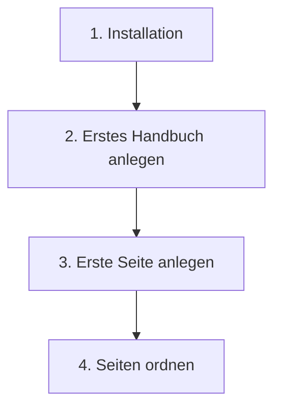

# Erste Schritte

Dieser Bereich führt dich in vier Schritten zum ersten sichtbaren Handbuch. Gehe die Seiten der Reihe nach durch. Jede baut auf der vorherigen auf. Du kennst WordPress schon gut? Dann fasst der [Schnellstart](../schnellstart.md) denselben Weg auf einer Seite zusammen. Eine fünfte, freiwillige Seite lädt dieses Handbuch als Beispiel in deine Installation.

| Seite | Was du danach hast |
|---|---|
| [Installation](installation.md) | Das Plugin läuft, die Seite „Handbuch“ existiert. |
| [Erstes Handbuch anlegen](erstes-handbuch-anlegen.md) | Ein Handbuch als Behälter für deine Seiten, mit passender Sichtbarkeit. |
| [Erste Seite anlegen](erste-seite-anlegen.md) | Eine veröffentlichte Seite, die auf der Website erscheint. |
| [Seiten ordnen](seiten-ordnen.md) | Eine Navigation, die deine Struktur abbildet. |
| [App-Handbuch laden](app-handbuch-laden.md) | Optional: dieses Handbuch als Anleitung und Beispiel in deiner Installation. |

Hinweis: Wenn du es zuerst nur ansehen willst

Du musst nicht bei null anfangen. Lade dieses Handbuch mit einem Klick in deine Installation: [App-Handbuch laden](app-handbuch-laden.md). Dann siehst du ein fertiges, gefülltes Handbuch. Darin kannst du herumklicken, bevor du dein eigenes baust.

## Transport-Metadaten
* Seitentyp: Bereichs-Übersicht
* Slug: erste-schritte
* Verantwortliche Rolle: Handbuch-Redaktion
* Thema: Einstieg
* Zielgruppe: Alle Mitglieder
* Eltern-Seite: Living Handbook
* Reihenfolge: 3
* Textauszug: Dieser Bereich führt dich in vier Schritten von der Installation bis zu einem Handbuch, das Besucherinnen und Besucher wirklich sehen können.
* Letzte Aktualisierung: 2026-08-05
* Letzte Prüfung: 2026-07-23
* Prüfintervall: 90 Tage
