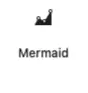
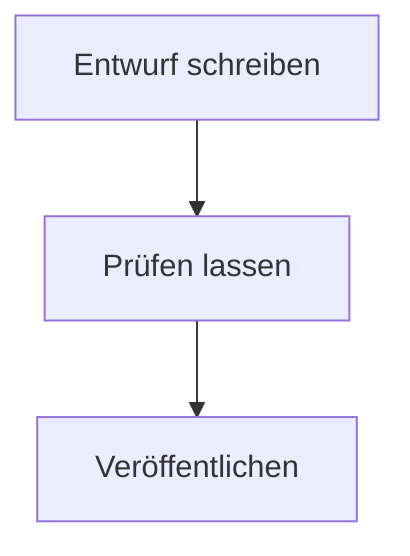
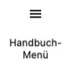
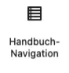

# Die Blöcke des Plugins

Living Handbook bringt eigene Blöcke mit, also Bausteine für den Editor. Du findest sie beim Einfügen unter der Kategorie **Living Handbook**. Diese Seite zeigt, welche du selbst einsetzt und welche das Plugin von allein platziert.

Über die Blöcke bestimmst du, was eine Seite kann. Du kombinierst sie frei mit den normalen WordPress-Blöcken und stellst jeden über seine Einstellungen ein. So gibst du einer Seite genau die Funktion, die sie braucht: ein Diagramm hier, eine seiteninterne Suche dort, eine Abzeichenzeile oder eine Bereichsliste. Wo die Blöcke in den mitgelieferten Seitenlayouts sitzen, legen die Templates fest, die du im Website-Editor umbauen kannst. Eine Handbuch-Seite ist also nichts Starres, sondern auf ihren Zweck zuschneidbar.

## Diese Blöcke setzt du selbst ein

### Mermaid



Zeichnet Diagramme direkt auf der Seite: Abläufe, Entscheidungswege, Hierarchien. Du beschreibst das Diagramm als Text in der Diagramm-Sprache [Mermaid](https://mermaid.js.org/); gezeichnet wird es beim Anzeigen der Seite. Füge den Block ein und schreibe die Beschreibung in das Feld **Mermaid-Code**. Ein Titel wird zur Bildunterschrift. Die Textbeschreibung wird vorgelesen, wenn jemand die Seite mit einem Screenreader nutzt. So sieht die Beschreibung eines kleinen Ablaufs aus:

```text
graph TD;
  A["Entwurf schreiben"] --> B["Prüfen lassen"];
  B --> C["Veröffentlichen"];
```

Und so wird sie gezeichnet:



Der Block funktioniert überall, auch mitten im Seiteninhalt. Kommt eine Seite aus einer Markdown-Datei, brauchst du ihn nicht von Hand zu setzen: Ein Codeblock mit der Sprachangabe `mermaid` wird beim [Import](../inhalte/markdown-importieren.md) automatisch zu diesem Block.

### Handbuch-Übersicht


Listet alle Handbücher, die die aktuelle Besucherin lesen darf, mit Name, Beschreibung und Seitenzahl. Die Aktivierung legt eine Seite mit diesem Block an. Du kannst ihn aber auf jede beliebige Seite setzen.

Unter jedem Handbuch stehen die ersten Seitentitel, damit man sieht, was drinsteht und nicht nur, wie es heisst. Gibt es mehr, als gezeigt wird, erscheint ein Link „Alle Seiten". Einstellungen: Anzeige als **Liste** oder als **Karten**, und **Seitentitel pro Handbuch** von 0 bis 10; 0 schaltet die Vorschau ab.

Hat ein Handbuch ein übergeordnetes, steht es eingerückt darunter und nennt es. Wichtig dabei: der Zugriff wird nicht vererbt. Jedes Handbuch entscheidet für sich, wer es lesen darf, ein untergeordnetes ist also nicht automatisch so geschützt wie das darüber. Darf jemand das übergeordnete nicht sehen, erscheint das untergeordnete trotzdem, dann einfach auf der obersten Ebene.

### Handbuch-Menü



Zeigt dieselbe Handbuch-Liste kompakt, gedacht für den Kopfbereich der Website. Auf schmalen Bildschirmen klappt er hinter einem Knopf zusammen. Meist ist die [Einbindung ins Theme-Menü](navigation-einbinden.md) die bessere Wahl; dieser Block ist die Alternative ohne Theme-Menü.

### GitHub-Quellenhinweis


Kennzeichnet eine Seite als [auf GitHub gepflegt](../inhalte/github-synchronisation.md) und verlinkt zusätzlich die Quelldatei auf GitHub, damit Lesende sie dort direkt öffnen können. Der Text des Hinweises ist anpassbar. Der Block zeigt sich nur auf Seiten mit GitHub-Quelle; überall sonst bleibt er unsichtbar. Du kannst ihn also einmal im Seitenlayout platzieren und vergessen.

## Diese Blöcke platziert das Plugin für dich

Die folgenden Blöcke sitzen schon an der richtigen Stelle in den mitgelieferten Seitenlayouts. Du begegnest ihnen nur, wenn du die Layouts im Website-Editor umbaust. Die meisten zeigen zudem nur in ihrem Zusammenhang etwas an; an anderer Stelle bleiben sie leer.

### Handbuch-Eintrag


Zeigt die Ergebnisspalte einer Einstiegsseite: die Bereichs-Kacheln und die zuletzt aktualisierten Seiten, oder die Treffer, solange eine Suche oder ein Filter aktiv ist. Wirkt nur auf der Einstiegsseite.

Eine Einstiegsseite besteht aus drei Blöcken: **Handbuch-Suche**, **Handbuch-Eintrag** und **Handbuch-Filterleiste**. Das mitgelieferte Template enthält alle drei, du siehst sie also im Editor und kannst sie verschieben oder weglassen. Sie finden einander über das Handbuch, das an der Ergebnisspalte hängt, egal wo auf der Seite sie stehen.

### Handbuch-Suche

Die Suchleiste eines Handbuchs. Sie sucht in dem Handbuch, zu dem die Seite gehört, grenzt die Ergebnisspalte ein und nimmt die gesetzten Filter mit.

In den Block-Einstellungen: Beschriftung ein oder aus und ihr Wortlaut, der Platzhaltertext, die Aufschrift der Schaltfläche und ob diese neben dem Feld, im Feld oder gar nicht erscheint. Ohne Schaltfläche sucht die Eingabetaste. Farben, Rahmen, Schrift und Abstände stellst du wie bei den Kern-Blöcken in der Seitenleiste ein.

Die Beschriftung steht immer im Dokument, auch wenn du sie ausblendest. Ein Suchfeld mit blossem Platzhalter verliert seinen Namen für Screenreader, sobald jemand etwas hineinschreibt.

### Handbuch-Filterleiste

Die Facetten-Filter eines Handbuchs als eigener Block: Seitentyp, Thema, Verantwortung, Zielgruppe. Angeboten wird nur, was die Seiten dieses Handbuchs wirklich tragen; solange nichts gesetzt ist, bleibt der Block leer. Er steuert die Ergebnisliste des Blocks „Handbuch-Eintrag“, auch wenn er an einer ganz anderen Stelle der Seite sitzt.

### Handbuch-Navigation



Zeigt den auf- und zuklappbaren Seitenbaum des Handbuchs. Anzeige als **Menü** (alles offen) oder **Akkordeon** (Äste klappen einzeln). Wirkt auf der Einstiegsseite und auf Einzelseiten.

### Handbuch-Badges


Zeigt die Abzeichen einer Seite: Seitentyp, Thema, Zielgruppe. Wirkt nur auf Einzelseiten.

### Inhaltsverzeichnis


Baut „Auf dieser Seite“ aus den Überschriften der Seite und markiert beim Lesen den aktuellen Abschnitt. Wirkt nur auf Einzelseiten.

### Handbuch-Schnellsuche


Ein Suchfeld, das schon beim Tippen passende Seiten des Handbuchs vorschlägt und direkt dorthin springt. Das ist nicht die Suchleiste: die grenzt die Ergebnisspalte ein, diese hier führt dich weg von der aktuellen Seite. Sie wirkt auf Einzelseiten und auf der Einstiegsseite.

Unter jedem Treffer steht der Satz, in dem die Wörter gefunden wurden, mit den Wörtern hervorgehoben. Das ist der Text der Seite rund um die Fundstelle, nicht ihr Textauszug: der wäre bei jeder Suche derselbe und würde nicht verraten, warum diese Seite passt. Traf die Suche nur den Titel, steht kein Satz darunter, weil es keinen gibt.

In den Block-Einstellungen: Beschriftung ein oder aus und ihr Wortlaut, dazu der Platzhaltertext. Farben, Rahmen, Schrift und Abstände wie bei den Kern-Blöcken in der Seitenleiste.

### Handbuch-Feedback


Stellt die Frage „War das hilfreich?“ mit Ja und Nein. Wirkt nur auf Einzelseiten. Standardmäßig sehen nur angemeldete Personen die Schaltflächen; öffentliches Feedback lässt sich in [den Einstellungen](../die-einstellungen.md) einschalten.

### Handbuch-Seiten-Meta


Zeigt Erstellt, Aktualisiert, Geprüft und die verantwortliche Rolle, samt Prüfstatus-Abzeichen. Wirkt nur auf Einzelseiten.

<details>
<summary>Hinweis: Einzelne Blöcke gezielt gestalten</summary>

Jeder Block bietet in der Seitenleiste unter **Erweitert** zwei Felder: eine **zusätzliche CSS-Klasse** und einen **HTML-Anker**. Mit der Klasse gestaltest du genau diesen einen Block, mit dem Anker verlinkst du direkt auf ihn. Die vollständige technische Referenz aller Blöcke steht in der [Entwickler-Dokumentation zu den Blöcken](https://github.com/rfluethi/living-handbook/blob/main/docs/technical/de/living-handbook-technical/bloecke.md).

</details>

## Verwandte Seiten

* [Die drei Oberflächen](die-drei-oberflaechen.md)
* [Navigation einbinden](navigation-einbinden.md)
* [Inhalte schreiben](../inhalte/inhalte-schreiben.md)

## Transport-Metadaten
* Seitentyp: Tool-Übersicht
* Verantwortliche Rolle: Handbuch-Redaktion
* Thema: Gestaltung
* Zielgruppe: Alle Mitglieder
* Eltern-Seite: Oberfläche
* Reihenfolge: 2
* Textauszug: Welche Blöcke des Plugins du selbst einsetzt, allen voran das Mermaid-Diagramm, und welche das Plugin von allein platziert.
* Letzte Aktualisierung: 2026-08-05
* Letzte Prüfung: 2026-07-23
* Prüfintervall: 180 Tage
