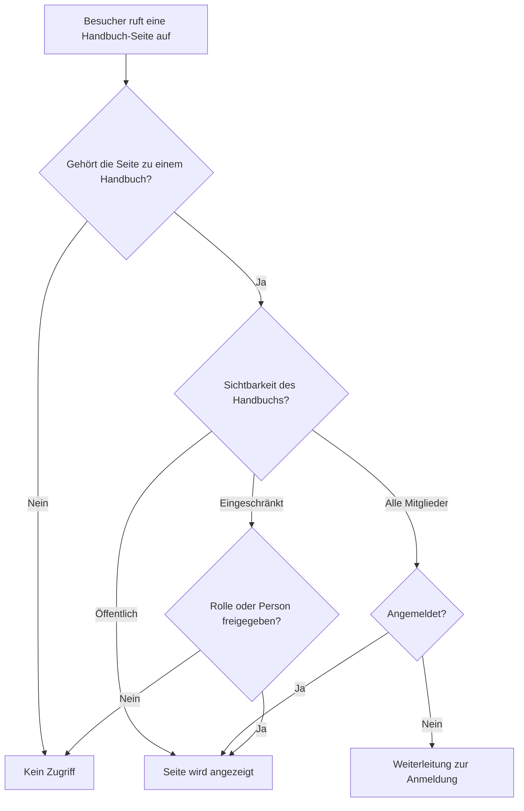

# Zugriff verstehen

Diese Seite beantwortet eine Frage: Warum zeigt Living Handbook im Zweifel lieber nichts an, als versehentlich etwas preiszugeben? Wer dieses Prinzip kennt, versteht jedes „Warum sehe ich nichts?“ sofort.

## Worum es geht

Ein internes Handbuch enthält Dinge, die nicht öffentlich sein sollen: Abläufe, Zuständigkeiten, interne Adressen. Der teuerste Fehler eines solchen Systems ist nicht eine unsichtbare Seite. Der teuerste Fehler ist eine versehentlich öffentliche Seite. Living Handbook folgt darum einer einfachen Grundregel: Im Zweifel wird versteckt. Fachleute nennen dieses Prinzip „fail-closed“.

Das Diagramm zeigt den Entscheidungsweg beim Aufruf einer Seite: von der Handbuch-Zuweisung über die Sichtbarkeit bis zur Anzeige, Anmeldung oder Ablehnung.

## Warum es so gebaut ist

* **Eine Regel pro Handbuch statt pro Seite.** Sichtbarkeit pro Seite klingt flexibel. Sie wird aber schnell unübersichtlich, denn niemand behält hundert Einzelregeln im Kopf. Eine Regel pro Handbuch kannst du in einem Satz aussprechen: „Das Team-Handbuch sehen alle Angemeldeten.“
* **Eine Seite ohne Handbuch ist unsichtbar.** Sie hat keine Regel, die Zugriff erlauben könnte. Also gilt die sichere Antwort: kein Zugriff. Das ist die häufigste Ursache für „meine Seite erscheint nicht“, siehe [Häufige Fragen](../haeufige-fragen.md).
* **Es gibt einen zentralen Prüfpunkt.** Jede Stelle, die Handbuch-Inhalte anzeigt, stellt vorher dieselbe Frage: Darf diese Person das lesen? Das gilt für Seiten, Suche, Filter, Menü und Feedback. Es gibt keine Hintertür, die vergessen gehen könnte.
* **Auch die Nebenwege sind geschlossen.** Handbuch-Seiten tauchen nicht in den technischen Listen auf, die Suchmaschinen und andere Websites auslesen. Ein internes Handbuch hinterlässt keine öffentlichen Spuren.

Eine Folge davon musst du kennen: Diese Zurückhaltung gilt auch für öffentliche Handbücher. Deren Seiten sind zwar für alle aufrufbar, werden von Suchmaschinen aber schlechter gefunden als normale Seiten. Das Plugin ist für interne Handbücher gebaut; eine öffentliche Produkt-Dokumentation mit Suchmaschinen-Anspruch ist nicht sein Kerneinsatz.

## Was das für deine Arbeit bedeutet

* Ein neues Handbuch startet auf **Alle Mitglieder**. Öffentlich wird es nur durch deine bewusste Entscheidung.
* Ein importiertes Handbuch startet ebenfalls auf **Alle Mitglieder**, egal was die Quelle sagt.
* Wenn etwas nicht erscheint, ist das fast nie ein Fehler, sondern die Schutzlogik. Prüfe Handbuch-Zuweisung und Sichtbarkeit, bevor du weitersuchst.

Hintergrund: Für Entwicklerinnen und Entwickler

Die zentrale Prüfung ist filterbar. So bekommt zum Beispiel ein Dienstkonto Lesezugriff auf alles. Eigene Lesepfade müssen immer durch diese Prüfung führen. Wie das geht, steht in der [Entwickler-Dokumentation zu den Hooks](https://github.com/rfluethi/living-handbook/blob/main/docs/technical/de/hooks.md).

## Bilder und Dateien

Ein Bild, das zu einer Handbuch-Seite gehört, erbt deren Zugriff: Es taucht nicht in der Medien-Schnittstelle auf, und wer die Seite nicht öffnen darf, bekommt auch den Eintrag des Bildes nicht.

Die Datei selbst ist nicht geschützt, und kein Plugin kann sie schützen. WordPress legt Uploads in `wp-content/uploads` ab, und dieser Ordner wird vom Webserver direkt ausgeliefert, ohne dass WordPress gefragt wird. Wer die Adresse der Datei kennt, kann sie öffnen. Für die meisten Handbücher ist das vertretbar, weil eine solche Adresse kaum zu erraten ist. Enthält dein Handbuch Bilder, die das Team nicht verlassen dürfen, lass den Upload-Ordner auf dem Server schützen, zum Beispiel mit einer Regel in `wp-content/uploads/.htaccess` bei Apache oder einem `location`-Block bei nginx.

## Verwandte Seiten

* [Sichtbarkeit einstellen](sichtbarkeit-einstellen.md)
* [Häufige Fragen](../haeufige-fragen.md)

## Transport-Metadaten
* Seitentyp: Hintergrund / Konzept
* Verantwortliche Rolle: Handbuch-Redaktion
* Thema: Zugriff
* Zielgruppe: Alle Mitglieder
* Eltern-Seite: Zugriff
* Reihenfolge: 2
* Textauszug: Living Handbook versteckt im Zweifel lieber, als versehentlich etwas preiszugeben; diese Seite erklärt das Fail-closed-Prinzip.
* Letzte Aktualisierung: 2026-08-05
* Letzte Prüfung: 2026-07-23
* Prüfintervall: 365 Tage
