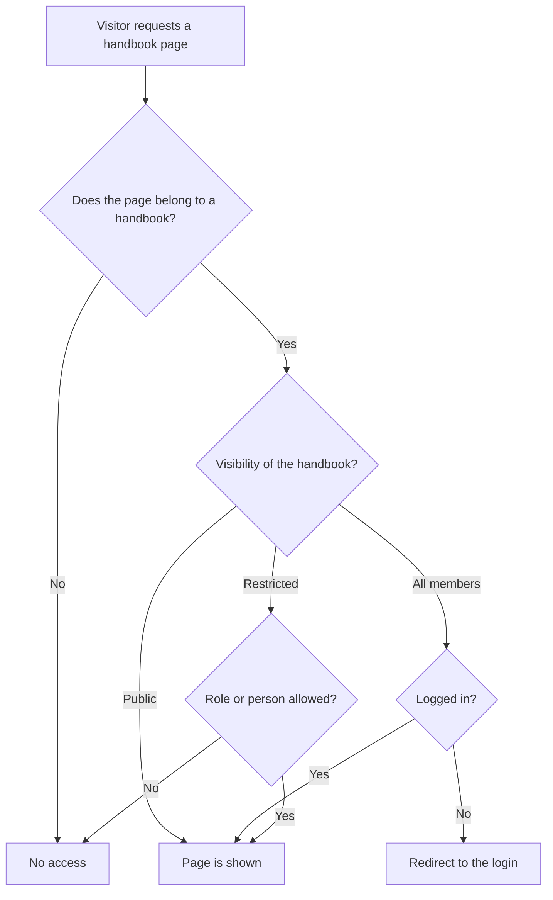

# Understanding access

This page answers one question: why does Living Handbook rather show nothing than give something away by accident? Once you know this principle, every "Why can't I see anything?" makes sense immediately.

## What this is about

An internal handbook contains things that should not be public: processes, responsibilities, internal addresses. The most expensive mistake of such a system is not an invisible page. The most expensive mistake is an accidentally public page. Living Handbook therefore follows one simple ground rule: when in doubt, hide. Specialists call this principle "fail-closed".

The diagram shows the decision path when a page is requested: from the handbook assignment through the visibility to display, login or denial.

## Why it is built this way

* **One rule per handbook instead of per page.** Visibility per page sounds flexible. But it quickly turns unmanageable, because nobody keeps a hundred individual rules in their head. A rule per handbook fits in one sentence: "All logged-in people see the team handbook."
* **A page without a handbook is invisible.** It has no rule that could allow access. So the safe answer applies: no access. This is the most common cause of "my page does not show up", see [Frequently asked questions](../faq.md).
* **There is one central checkpoint.** Every place that shows handbook content first asks the same question: may this person read this? That holds for pages, search, filters, menu and feedback. There is no back door that could be forgotten.
* **The side paths are closed too.** Handbook pages do not appear in the technical lists that search engines and other websites read out. An internal handbook leaves no public traces.

One consequence you need to know: this restraint also applies to public handbooks. Their pages can be opened by anyone, but search engines find them less well than normal pages. The plugin is built for internal handbooks; a public product documentation with search-engine ambitions is not its core use.

## What this means for your work

* A new handbook starts on **All members**. It becomes public only through your deliberate decision.
* An imported handbook also starts on **All members**, whatever the source says.
* When something does not show up, it is almost never a bug but the protection logic. Check the handbook assignment and the visibility before you look further.

Background: For developers

The central check is filterable, for example to give a service account read access to everything. Your own read paths must always route through this check. How that works is in the [developer documentation on the hooks](https://github.com/rfluethi/living-handbook/blob/main/docs/technical/en/living-handbook-technical/hooks.md).

## Images and files

An image that belongs to a handbook page inherits that page's access: it is not listed in the media endpoint, and someone who may not open the page cannot read its entry either.

The file itself is not protected, and no plugin can protect it. WordPress keeps uploads in `wp-content/uploads`, and the web server hands that folder out directly, without asking WordPress first. Anyone with the file's address can open it. For most handbooks that is acceptable, because an address is hard to guess. If your handbook holds images that must not leave the team, ask whoever runs the server to protect the uploads folder, for example with a rule in `wp-content/uploads/.htaccess` on Apache or a `location` block on nginx.

## Related pages

* [Set visibility](set-visibility.md)
* [Frequently asked questions](../faq.md)

## Transport-Metadaten
* Seitentyp: Background / Concept
* Verantwortliche Rolle: Handbook editors
* Thema: Access
* Zielgruppe: All members
* Eltern-Seite: Access
* Reihenfolge: 2
* Textauszug: Living Handbook rather hides than gives something away by accident; this page explains the fail-closed principle.
* Letzte Aktualisierung: 2026-08-05
* Letzte Prüfung: 2026-07-27
* Prüfintervall: 365 Tage
