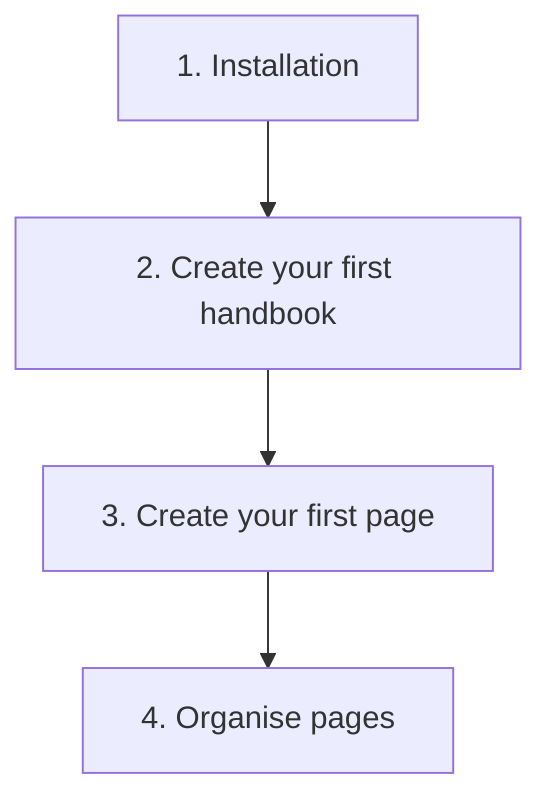

# Getting started

This area takes you to your first visible handbook in four steps. Work through the pages in order. Each one builds on the previous. Do you already know WordPress well? Then the [Quick start](../quick-start.md) sums up the same path on one page. A fifth, optional page loads this handbook into your installation as an example.

| Page | What you have afterwards |
|---|---|
| [Installation](installation.md) | The plugin runs, the "Handbook" page exists. |
| [Create your first handbook](create-your-first-handbook.md) | A handbook as the container for your pages, with the right visibility. |
| [Create your first page](create-your-first-page.md) | A published page that shows up on the website. |
| [Organise pages](organise-pages.md) | A navigation that mirrors your structure. |
| [Load the app handbook](load-the-app-handbook.md) | Optional: this handbook as guide and example in your installation. |

Tip: If you just want to look around first

You do not have to start from zero. Load this handbook into your installation with one click: [Load the app handbook](load-the-app-handbook.md). Then you have a finished, filled handbook. Click around in it before you build your own.

## Transport-Metadaten
* Seitentyp: Area overview
* Slug: getting-started
* Verantwortliche Rolle: Handbook editors
* Thema: Getting started
* Zielgruppe: All members
* Eltern-Seite: Living Handbook
* Reihenfolge: 3
* Textauszug: This area takes you in four steps from installation to a handbook that visitors can actually see.
* Letzte Aktualisierung: 2026-08-05
* Letzte Prüfung: 2026-07-27
* Prüfintervall: 90 Tage
