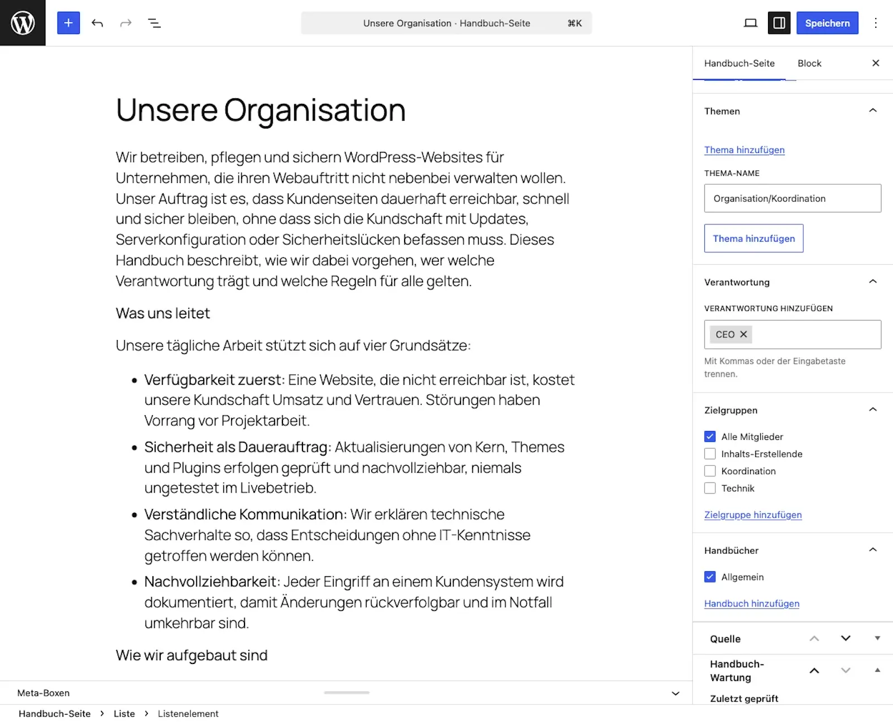

# Create your first page

This guide creates your first handbook page. The steps: write, assign to a handbook, classify, set review data, publish.

Requirements: What must already exist

* A handbook, see [Create your first handbook](create-your-first-handbook.md).
* A user account that may edit pages (Editor or Administrator).

## Steps

1. Open **Handbook pages → Add new handbook page**. The familiar block editor opens.
2. Write the page like any other: a clear title, a short opening sentence, then the content.
3. **Assign the page to a handbook in the sidebar.** Almost everyone misses this step. A page without a handbook stays invisible on the website.
4. **Classify the page**, also in the sidebar. Pick the page type (for example Guide or Background), a topic, the audience and the responsible role. These produce the badges on the page and the filters on the handbook's entry page. You manage your own terms centrally, see [Classification and roles](../upkeep/tags-and-roles.md).
5. Fill in the **Handbook maintenance** box at the bottom of the editor: responsible role, last review, review interval. Rough values are better than none. You can refine them later. What these fields do is explained in [The review cycle](../upkeep/the-review-cycle.md).
6. Click **Publish**.

## Result

The page is reachable on the website at `/handbook/<page-name>/`. On the entry page of its handbook it appears under "Recently updated". At the top it shows the badges, on the right the "On this page" list. At the very bottom sit the page details, with the review status as a badge.

Pitfalls: "My page does not show up"

Almost always it is one of three causes: The page has no handbook assigned. Or the handbook is not visible to the current visitor. Or the page is still a draft. The order to check them in, and the fixes, are under [Frequently asked questions](../faq.md).

## Related pages

* [Organise pages](organise-pages.md)
* [Review pages](../upkeep/review-pages.md)
* [Writing content](../content/writing-content.md)

## Transport-Metadaten
* Seitentyp: Guide
* Verantwortliche Rolle: Handbook editors
* Thema: Getting started
* Zielgruppe: All members
* Eltern-Seite: Getting started
* Reihenfolge: 3
* Textauszug: This guide creates your first handbook page: write, assign to a handbook, classify, set review data, publish.
* Letzte Aktualisierung: 2026-08-05
* Letzte Prüfung: 2026-07-27
* Prüfintervall: 180 Tage
