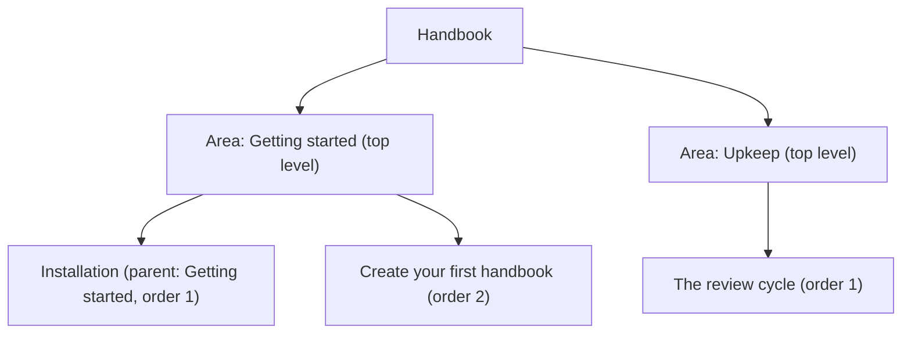

# Organise pages

You do not build a handbook's navigation by hand. It grows out of the page hierarchy. This guide shows how you shape the structure with parent page and order.

Concept: Hierarchy instead of menu upkeep

A hand-maintained menu and the actual pages drift apart over time. Pages appear, the menu lags behind. That is why Living Handbook builds the navigation straight from the order of the pages. Top-level pages become the **areas**. They appear as tiles on the handbook's entry page. Their subpages form the navigation tree. Whatever you organise is automatically in the menu.

## Steps

1. Open a handbook page in the editor.
2. In the sidebar, open the **Page Attributes** section.
3. Under **Parent page**, choose the page above this one. No parent page means: this page is an area on the top level.
4. Under **Order**, set a number. Small numbers sit at the top. Just number 1, 2, 3.
5. Update the page. The navigation rebuilds itself.

## Result

The page sits at the chosen place in the navigation tree. A top-level page additionally appears as an area tile on the handbook's entry page. This handbook is an example: every area such as "Getting started" or "Upkeep" is a top-level page with subpages. The diagram shows this order as a tree.

Tip: If your pages come from an import

When you import a folder, the order grows automatically out of the files' folder structure. A repeat import restores that order. A parent page changed by hand is reset in the process. So organise imported handbooks in the files themselves. How that works is under [Import Markdown](../content/import-markdown.md).

## Related pages

* [The three surfaces](../interface/the-three-surfaces.md)
* [Add handbooks to your menu](../interface/add-to-the-menu.md)

## Transport-Metadaten
* Seitentyp: Guide
* Verantwortliche Rolle: Handbook editors
* Thema: Getting started
* Zielgruppe: All members
* Eltern-Seite: Getting started
* Reihenfolge: 4
* Textauszug: A handbook's navigation grows out of the page hierarchy; this guide shows how you shape it with parent page and order.
* Letzte Aktualisierung: 2026-08-05
* Letzte Prüfung: 2026-07-27
* Prüfintervall: 180 Tage
