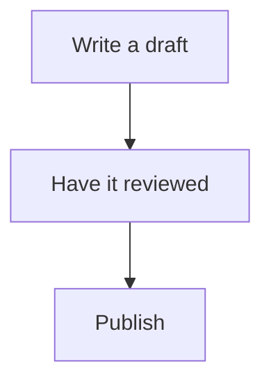
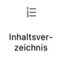

# The blocks

Living Handbook ships blocks of its own, building parts for the editor. You find them when inserting a block, under the **Living Handbook** category. This page shows which ones you use yourself and which ones the plugin places on its own.

Through the blocks you decide what a page can do. You combine them freely with the normal WordPress blocks and configure each one through its settings. That way you give a page exactly the function it needs: a diagram here, an in-page search there, a badge row or an area list. Where the blocks sit in the shipped page layouts is set by the templates, which you can rebuild in the Site Editor. A handbook page is nothing rigid; it can be tailored to its purpose.

## Blocks you use yourself

### Mermaid


Draws diagrams right on the page: workflows, decision paths, hierarchies. You describe the diagram as text in the diagram language [Mermaid](https://mermaid.js.org/); it is drawn when the page is shown. Insert the block and write the description into the **Mermaid code** field. A title becomes the caption. The text description is read aloud when someone uses the page with a screen reader. This is what the description of a small workflow looks like:

```text
graph TD;
  A["Write a draft"] --> B["Have it reviewed"];
  B --> C["Publish"];
```

And this is how it is drawn:



The block works everywhere, including in the middle of page content. If a page comes from a Markdown file, you do not need to place it by hand: a code block with the language `mermaid` becomes this block automatically on [import](../content/import-markdown.md).

### Handbook overview


Lists every handbook the current visitor may read, with name, description and page count. Activation creates a page with this block. You can also put it on any page you like.

Under each handbook stand the first page titles, so you see what is in it and not only what it is called. When there is more than is shown, an "All pages" link appears. Settings: display as **List** or as **Cards**, and **Page titles under each handbook** from 0 to 10; 0 turns the preview off.

A handbook that has a parent handbook stands set in below it and names it. One thing matters here: access is not inherited. Every handbook decides for itself who may read it, so a handbook below another is not automatically as protected as the one above. If someone may not see the parent, the child still appears, simply at the top level.

### Handbook menu


Shows the same handbook list compactly, meant for the website's header. On narrow screens it collapses behind a button. Usually the [menu integration](add-to-the-menu.md) is the better choice; this block is the alternative without a theme menu.

### GitHub source note


Marks a page as [maintained on GitHub](../content/github-sync.md) and also links the source file on GitHub, so readers can open it there directly. The note's text is editable. The block only shows itself on pages with a GitHub source; everywhere else it stays invisible. So you can place it once in the page layout and forget about it.

## Blocks the plugin places for you

The following blocks already sit in the right place in the shipped page layouts. You only meet them when you rebuild the layouts in the Site Editor. Most of them also only show something in their context; anywhere else they stay empty.

### Handbook entry


Shows the result column of an entry page: the area tiles and the recently updated pages, or the matches while a search or a filter is active. Works only on the entry page.

An entry page is three blocks: **Handbook search**, **Handbook entry** and **Handbook filter bar**. The shipped template holds all three, so you see them in the editor and can move them or leave one out. They find each other through the handbook that hangs on the result column, wherever on the page they sit.

### Handbook search

A handbook's search bar. It searches the handbook the page belongs to, narrows the result column, and carries the active filters along.

In the block settings: the label on or off and its wording, the placeholder, the button text, and whether the button sits beside the field, inside it, or not at all. Without a button, Enter searches. Colours, border, typography and spacing are set in the sidebar, the same way as for the core blocks.

The label is in the document even when you hide it. A search field with nothing but a placeholder loses its name for screen readers as soon as someone types into it.

### Handbook filter bar

A handbook's facet filters as their own block: page type, topic, responsibility, audience. It only offers what the pages of this handbook actually carry, so it stays empty until something is set. It drives the result list of the Handbook entry block, even when it sits somewhere else entirely on the page.

### Handbook navigation


Shows the handbook's collapsible page tree. Display as **Menu** (everything open) or **Accordion** (branches collapse individually). Works on the entry page and on single pages.

### Handbook badges


Shows a page's badges: page type, topic, audience. Works only on single pages.

### Table of Contents



Builds "On this page" from the page's headings and highlights the current section while you read. Works only on single pages.

### Handbook quick search


A search field that suggests matching pages of the handbook as you type and jumps straight there. It is not the search bar: that narrows the result column, this one takes you away from the current page. It works on single pages and on the entry page.

Under each result stands the sentence the words were found in, with the words highlighted. That is the page's own text around the hit, not its excerpt: an excerpt would be the same for every search and would not tell you why this page matched. When the search only matched the title, there is no sentence, so none is shown.

In the block settings: the label on or off and its wording, plus the placeholder. Colours, border, typography and spacing as for the core blocks in the sidebar.

### Handbook feedback


Asks "Was this helpful?" with Yes and No. Works only on single pages. By default only logged-in people see the buttons; public feedback can be switched on in [the settings](../the-settings.md).

### Handbook page meta


Shows Created, Last updated, Last reviewed and the responsible role, including the review-status badge. Works only on single pages.

<details>
<summary>Tip: Styling single blocks deliberately</summary>

Every block offers two fields in the sidebar under **Advanced**: an **additional CSS class** and an **HTML anchor**. With the class you style exactly this one block, with the anchor you link straight to it. The full technical reference of all blocks is in the [developer documentation on the blocks](https://github.com/rfluethi/living-handbook/blob/main/docs/technical/en/blocks.md).

</details>

## Related pages

* [The three surfaces](the-three-surfaces.md)
* [Add handbooks to your menu](add-to-the-menu.md)
* [Writing content](../content/writing-content.md)

## Transport-Metadaten
* Seitentyp: Tool overview
* Verantwortliche Rolle: Handbook editors
* Thema: Design
* Zielgruppe: All members
* Eltern-Seite: Interface
* Reihenfolge: 2
* Textauszug: Which blocks of the plugin you use yourself, first of all the Mermaid diagram, and which ones the plugin places on its own.
* Letzte Aktualisierung: 2026-08-05
* Letzte Prüfung: 2026-07-27
* Prüfintervall: 180 Tage
