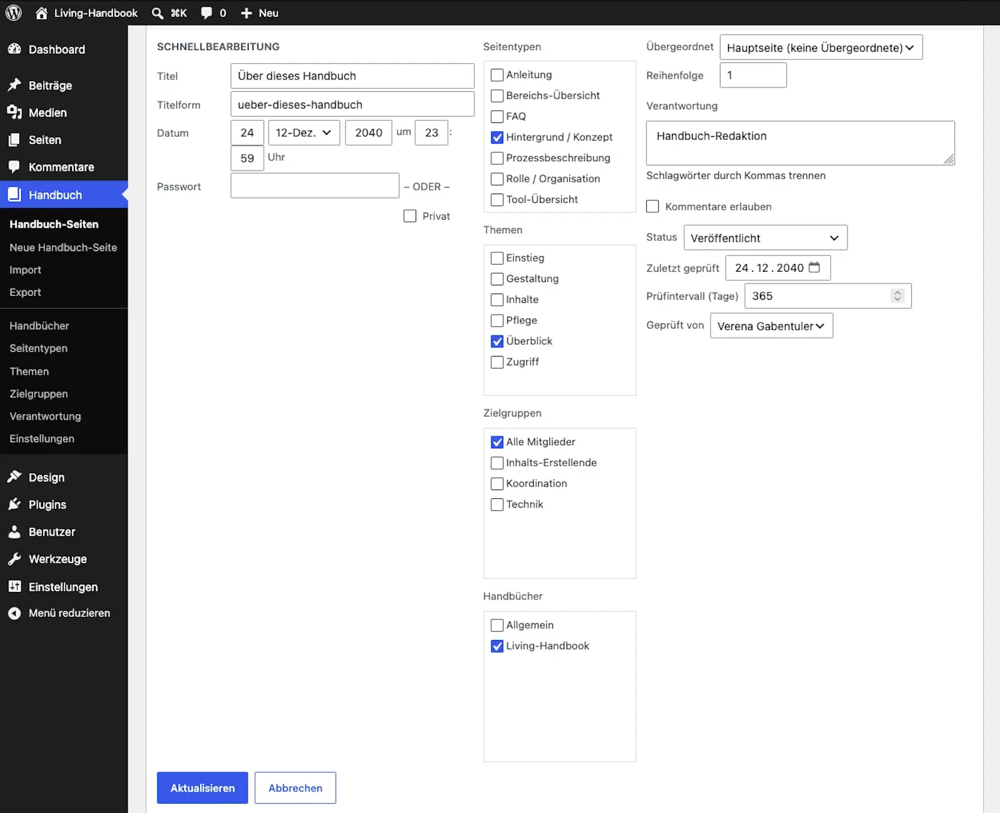

# Review pages

This guide shows the practical review work: confirming single pages, working through many pages quickly, and reliably finding the overdue ones.

Requirements: What you should know

* The idea behind review date, interval and the three states, see [The review cycle](the-review-cycle.md).
* A user account that may edit handbook pages.

## Reviewing a single page

1. Open the page in the editor.
2. Read it with the question: would I still write this the same way today?
3. Does the content still hold? Then set the review date to today in the **Handbook maintenance** box at the bottom of the editor. Does it no longer hold? Then fix the content first.
4. Update the page.

## Reviewing many pages quickly

For the common case "read it, still holds" you do not even have to open the page:

1. Open the page list under **Handbook pages**.
2. Hover over a row and click **Quick Edit**.
3. There sit the review date, the reviewer and the review interval, prefilled with the current values. Set the date anew and save.

## Finding overdue pages

Three tools lead you to the pages that need attention:

* **The box on the dashboard**, the start screen of the WordPress admin, lists every page whose review is due or overdue. It is the best entry into the review work: go through it top to bottom, review, reset the date.
* **The status filter above the page list** pulls out everything due, overdue or never reviewed with one click. Next to it sit dropdowns. They filter by handbook, page type, topic, role, audience and source. You only see the dropdowns that are of use to you: hide a column under "Screen Options" at the top right and its dropdown goes with it, and a vocabulary without a single term gets none at all. If you are currently filtering by something whose column is hidden, that dropdown stays, so you can take the filter back.
* **The "Last reviewed" column** can be sorted. The useful direction: oldest reviews first.

Two warnings can additionally appear above the list. One names pages without a handbook, which stay invisible on the website. The other names pages whose GitHub sync failed. Both link the affected pages directly.

## Result

All pages carry a current review date. The box on the dashboard is empty. The badges on the pages read "Reviewed". Your readers see on every page: someone is paying attention here.

## Related pages

* [The review cycle](the-review-cycle.md)
* [Reading feedback](reading-feedback.md)

## Transport-Metadaten
* Seitentyp: Guide
* Verantwortliche Rolle: Handbook editors
* Thema: Upkeep
* Zielgruppe: All members
* Eltern-Seite: Upkeep
* Reihenfolge: 2
* Textauszug: The practical review work: confirming single pages, working through many quickly, and reliably finding the overdue ones.
* Letzte Aktualisierung: 2026-08-05
* Letzte Prüfung: 2026-07-27
* Prüfintervall: 180 Tage
