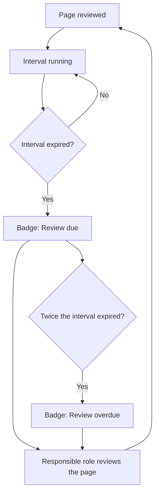

# The review cycle

This page explains the heart of the plugin. Every page carries a review date and a review interval. From them it becomes visible how reliable a page currently is. Nothing is deleted and nothing is hidden. The handbook merely stops pretending a page is current.

## What this is about

Every page carries two dates and one interval:

* **Last updated** sets itself when you save. It shows the state of the content.
* **Last reviewed** is set by a person, by hand. It means: "I have read this, it still holds." That counts even when nothing was changed. Only a human can say it. That is why it never sets itself.
* **The review interval** says how long a review stays valid. Fast-moving topics get a short interval, such as tools and external services. Stable topics get a long one, such as principles and organisation.

From the review date and the interval, the plugin computes the state. It appears as a badge at the bottom of every page:

There is a fourth state, **Not reviewed**, for pages with no review date or no interval. It is deliberately neutral rather than a warning: a page nobody has looked at yet is not a page that went stale, and every page starts here. Otherwise a freshly imported handbook would look neglected on its first day. What this state asks for is not a review but a decision: set a review date and an interval. After that the page joins the cycle.

Besides its colour, every state has its own shape and a text label. It stays recognisable without colour vision and with a screen reader. The dot of **Not reviewed** is an outlined circle rather than a filled one, matching a field nobody has filled in.

The diagram shows the cycle: after the review the interval runs. When it expires, the badge appears, and the responsible role reviews again.

## Why it is built this way

* **"Due" does not mean "wrong".** It only means: nobody has confirmed it lately. After twice the interval, the state escalates to "overdue". That way a page does not age quietly.
* **Responsibility sits with roles, not people.** Every page names a responsible role. Which person currently holds the role is maintained in a single place outside the pages, for example on a page of its own called "Roles in the team". A staffing change therefore does not mean touching a hundred pages. How you create roles is under [Tags and roles](tags-and-roles.md).
* **There is no central handbook owner.** Upkeep is distributed: every role keeps its own pages current. Cross-cutting work sits with an editorial role, such as structure, reading feedback and spot checks.

## What this means for your work

**Choosing an interval:** Short intervals on pages that never change produce noise. And noise teaches people to ignore badges. Twelve months are a sensible default. Three months only where going stale really causes damage, such as access rules.

**What a review is:** reading the page and asking one question: would I still write this the same way today? If yes, confirm the date, done. How that works in practice is under [Review pages](review-pages.md).

**The second path besides the schedule:** The healthiest upkeep is the occasion-driven one. When a process or a tool changes, adjust the affected page in the same working step. Not later, not as a separate chore.

Background: Versions

The pages live in WordPress. So the WordPress revisions are the version history: who changed what, and when. An earlier state can be restored. A separate changelog per page is not needed.

## Related pages

* [Review pages](review-pages.md)
* [Reading feedback](reading-feedback.md)

## Transport-Metadaten
* Seitentyp: Background / Concept
* Verantwortliche Rolle: Handbook editors
* Thema: Upkeep
* Zielgruppe: All members
* Eltern-Seite: Upkeep
* Reihenfolge: 1
* Textauszug: Every page carries a review date and a review interval; from them it becomes visible how reliable a page currently is.
* Letzte Aktualisierung: 2026-08-05
* Letzte Prüfung: 2026-08-05
* Prüfintervall: 180 Tage
