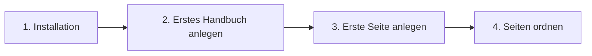

# Erste Schritte

Dieser Bereich führt dich in vier Schritten von der Installation bis zu einem Handbuch, das Besucherinnen und Besucher wirklich sehen können. Gehe die Seiten der Reihe nach durch; jede baut auf der vorherigen auf.

| Seite | Was du danach hast |
|---|---|
| [Installation](installation.md) | Das Plugin läuft, die Seite „Handbuch“ existiert. |
| [Erstes Handbuch anlegen](erstes-handbuch-anlegen.md) | Ein Handbuch als Behälter für deine Seiten, mit passender Sichtbarkeit. |
| [Erste Seite anlegen](erste-seite-anlegen.md) | Eine veröffentlichte Seite, die im Frontend erscheint. |
| [Seiten ordnen](seiten-ordnen.md) | Eine Navigation, die deine Struktur abbildet. |

Hinweis: Wenn du es zuerst nur ansehen willst

Du musst nicht bei null anfangen, um das Plugin kennenzulernen. Lade dieses Handbuch selbst in deine Installation: **Handbuch → Import**, Reiter **App-Handbuch**, **App-Handbuch laden**. Dann siehst du ein fertiges, gefülltes Handbuch und kannst darin herumklicken, bevor du dein eigenes baust. Details dazu stehen unter [Markdown importieren](../inhalte/markdown-importieren.md).

## Transport-Metadaten
* Seitentyp: Bereichs-Übersicht
* Reihenfolge: 2
* Textauszug: Dieser Bereich führt dich in vier Schritten von der Installation bis zu einem Handbuch, das Besucherinnen und Besucher wirklich sehen können.
* Letzte Prüfung: 2026-07-23
* Prüfintervall: 180 Tage
