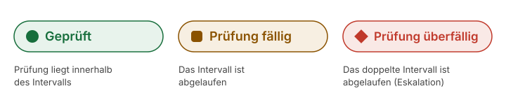

# Erste Seite anlegen

Diese Anleitung erstellt deine erste Handbuch-Seite: schreiben, einem Handbuch zuweisen, klassifizieren, Prüfdaten setzen, veröffentlichen.

Voraussetzungen: Was schon da sein muss

* Ein angelegtes Handbuch, siehe [Erstes Handbuch anlegen](erstes-handbuch-anlegen.md).
* Ein Benutzerkonto, das Seiten bearbeiten darf (Redakteur oder Administrator).

## Schritte

1. Öffne **Handbuch → Erstellen**. Es öffnet sich der gewohnte Block-Editor.
2. Schreibe die Seite wie jede andere: ein klarer Titel, ein kurzer Einleitungssatz, dann der Inhalt.
3. **Weise die Seite in der Seitenleiste einem Handbuch zu.** Das ist der eine Schritt, den fast alle übersehen: Eine Seite ohne Handbuch bleibt im Frontend unsichtbar.
4. **Klassifiziere die Seite** in der Seitenleiste: Seitentyp (Anleitung, Prozess, Referenz, Rolle, Hintergrund, FAQ), ein oder mehrere Themen, die Zielgruppe und die verantwortliche Rolle. Diese Angaben erzeugen die Abzeichen auf der Seite und die Filter auf der Einstiegsseite.
5. Fülle unten im Editor die Metabox **Handbuch-Wartung** aus: verantwortliche Rolle, letzte Prüfung, Prüfintervall. Auch grobe Werte sind besser als keine; verfeinern kannst du später.
6. Klicke auf **Veröffentlichen**.

> **Screenshot folgt:** Der Block-Editor mit geöffneter Seitenleiste, markiert sind die Handbuch-Zuweisung und die Klassifizierung; darunter die Metabox „Handbuch-Wartung“.

## Ergebnis

Die Seite ist unter `/handbook/<seitenname>/` erreichbar und erscheint auf der Einstiegsseite ihres Handbuchs unter „Zuletzt aktualisiert“. Sie zeigt oben die Abzeichen, rechts das Inhaltsverzeichnis und unten die Metadaten-Fußzeile mit dem Prüfstatus.

Stolpersteine: „Meine Seite erscheint nicht“

Fast immer hat das eine von drei Ursachen: Die Seite hat kein Handbuch zugewiesen, das Handbuch ist für die aktuelle Besucherin nicht sichtbar, oder die Seite ist noch ein Entwurf. Die Prüfreihenfolge und die Lösungen stehen unter [Häufige Fragen](../haeufige-fragen.md).

## Verwandte Seiten

* [Seiten ordnen](seiten-ordnen.md)
* [Seiten prüfen](../pflege/seiten-pruefen.md)
* [Inhalte schreiben](../inhalte/inhalte-schreiben.md)

## Transport-Metadaten
* Seitentyp: Anleitung
* Reihenfolge: 3
* Textauszug: Diese Anleitung erstellt deine erste Handbuch-Seite: schreiben, einem Handbuch zuweisen, klassifizieren, Prüfdaten setzen, veröffentlichen.
* Letzte Prüfung: 2026-07-23
* Prüfintervall: 180 Tage
