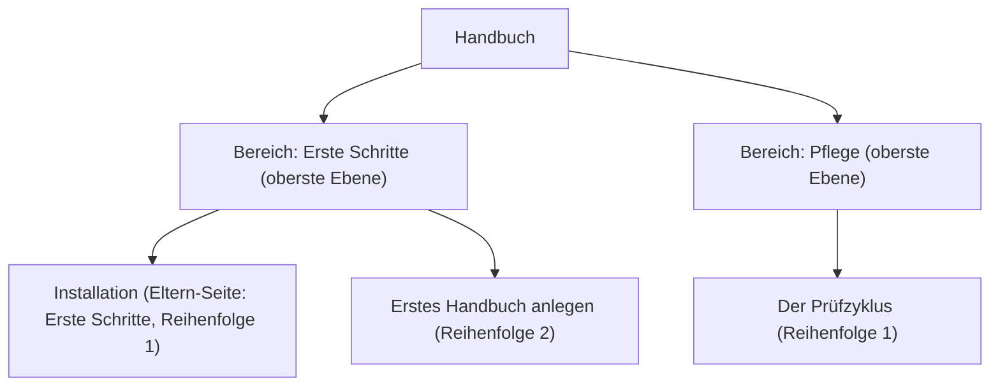

# Seiten ordnen

Die Navigation eines Handbuchs baust du nicht von Hand: Sie entsteht aus der Hierarchie der Seiten. Diese Anleitung zeigt, wie du mit Eltern-Seite und Reihenfolge die Struktur bestimmst.

Konzept: Hierarchie statt Menüpflege

Ein handgepflegtes Menü und die tatsächlichen Seiten laufen mit der Zeit auseinander: Seiten entstehen, das Menü hinkt nach. Darum liest Living Handbook die Navigation direkt aus der Seitenhierarchie. Seiten der obersten Ebene werden zu den **Bereichen**, die als Kacheln auf der Einstiegsseite erscheinen; ihre Unterseiten bilden den Navigationsbaum. Was in der Hierarchie steht, steht damit automatisch im Menü.

## Schritte

1. Öffne eine Handbuch-Seite im Editor.
2. Öffne in der Seitenleiste den Abschnitt **Seiten-Attribute**.
3. Wähle unter **Eltern-Seite** die übergeordnete Seite. Keine Eltern-Seite bedeutet: Diese Seite ist ein Bereich auf der obersten Ebene.
4. Setze unter **Reihenfolge** eine Zahl. Kleine Zahlen stehen oben; nummeriere einfach 1, 2, 3.
5. Aktualisiere die Seite. Die Navigation baut sich selbst neu.

## Ergebnis

Die Seite steht an der gewählten Stelle im Navigationsbaum links und, falls sie oberste Ebene ist, als Bereichskachel auf der Einstiegsseite. Ein Beispiel: Dieses Handbuch hat die Bereiche „Erste Schritte“, „Inhalte“, „Oberfläche“, „Zugriff“ und „Pflege“; jeder ist eine Seite oberster Ebene mit Unterseiten.

Hinweis: Wenn deine Seiten aus einem Import stammen

Beim Import eines ganzen Ordners von GitHub oder aus einer ZIP-Datei entsteht die Hierarchie automatisch aus der Ordnerstruktur, und die Reihenfolge kommt aus den Transport-Metadaten der Dateien. Bei einem erneuten Import setzt das Repository die Struktur wieder durch; eine von Hand geänderte Eltern-Seite wird dann zurückgesetzt. Für importierte Handbücher ordnest du also besser in den Quelldateien, siehe [Markdown importieren](../inhalte/markdown-importieren.md).

## Verwandte Seiten

* [Die drei Oberflächen](../oberflaeche/die-drei-oberflaechen.md)
* [Navigation einbinden](../oberflaeche/navigation-einbinden.md)

## Transport-Metadaten
* Seitentyp: Anleitung
* Reihenfolge: 4
* Textauszug: Die Navigation eines Handbuchs entsteht aus der Hierarchie der Seiten; diese Anleitung zeigt, wie du sie mit Eltern-Seite und Reihenfolge bestimmst.
* Letzte Prüfung: 2026-07-23
* Prüfintervall: 180 Tage
