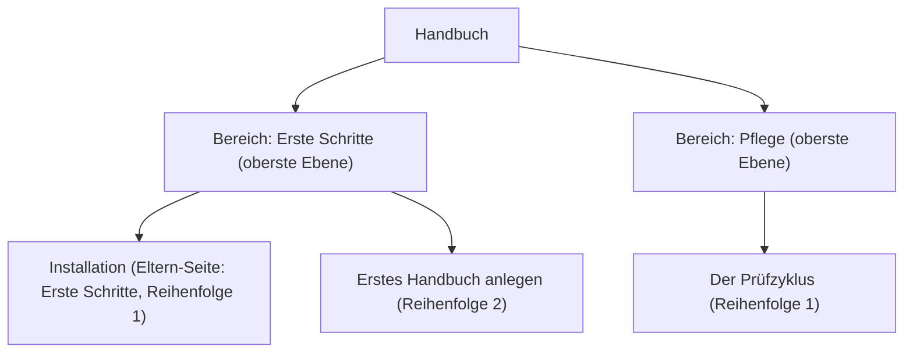

# Seiten ordnen

Die Navigation eines Handbuchs baust du nicht von Hand. Sie entsteht aus der Hierarchie der Seiten. Diese Anleitung zeigt, wie du die Struktur mit Eltern-Seite und Reihenfolge bestimmst.

Konzept: Hierarchie statt Menüpflege

Ein von Hand gepflegtes Menü und die tatsächlichen Seiten laufen mit der Zeit auseinander. Seiten entstehen, das Menü hinkt nach. Darum baut Living Handbook die Navigation direkt aus der Ordnung der Seiten. Seiten der obersten Ebene werden zu den **Bereichen**. Sie erscheinen als Kacheln auf der Einstiegsseite des Handbuchs. Ihre Unterseiten bilden den Navigationsbaum. Was du ordnest, steht damit automatisch im Menü.

## Schritte

1. Öffne eine Handbuch-Seite im Editor.
2. Öffne in der Seitenleiste den Abschnitt **Seiten-Attribute**.
3. Wähle unter **Eltern-Seite** die übergeordnete Seite. Keine Eltern-Seite bedeutet: Diese Seite ist ein Bereich auf der obersten Ebene.
4. Setze unter **Reihenfolge** eine Zahl. Kleine Zahlen stehen oben. Nummeriere einfach 1, 2, 3.
5. Aktualisiere die Seite. Die Navigation baut sich selbst neu.

## Ergebnis

Die Seite steht an der gewählten Stelle im Navigationsbaum. Eine Seite oberster Ebene erscheint zusätzlich als Bereichskachel auf der Einstiegsseite des Handbuchs. Ein Beispiel ist dieses Handbuch: Jeder Bereich wie „Erste Schritte“ oder „Pflege“ ist eine Seite oberster Ebene mit Unterseiten.

Hinweis: Wenn deine Seiten aus einem Import stammen

Kommen deine Seiten aus importierten Markdown-Dateien, entsteht die Ordnung automatisch aus der Ordnerstruktur der Dateien. Ein erneuter Import stellt diese Ordnung wieder her. Eine von Hand geänderte Eltern-Seite wird dabei zurückgesetzt. Ordne importierte Handbücher darum in den Dateien selbst. Wie das geht, steht unter [Markdown importieren](../inhalte/markdown-importieren.md).

## Verwandte Seiten

* [Die drei Oberflächen](../oberflaeche/die-drei-oberflaechen.md)
* [Navigation einbinden](../oberflaeche/navigation-einbinden.md)

## Transport-Metadaten
* Seitentyp: Anleitung
* Reihenfolge: 4
* Textauszug: Die Navigation eines Handbuchs entsteht aus der Hierarchie der Seiten; diese Anleitung zeigt, wie du sie mit Eltern-Seite und Reihenfolge bestimmst.
* Letzte Prüfung: 2026-07-23
* Prüfintervall: 180 Tage
