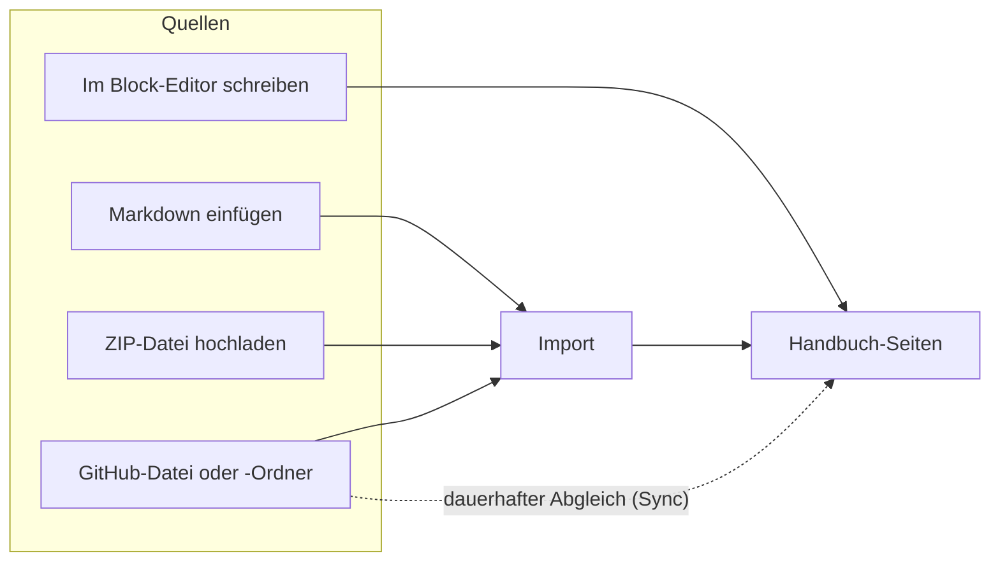

# Inhalte

Dieser Bereich erklärt, wie Inhalte in dein Handbuch kommen. Es gibt zwei Wege: Du schreibst direkt in WordPress. Oder du bringst Markdown-Dateien mit, per Import oder dauerhaft synchronisiert von GitHub.

| Seite | Wann du sie brauchst |
|---|---|
| [Inhalte schreiben](inhalte-schreiben.md) | Immer: was in Handbuch-Seiten gehört und welches Markdown den Import übersteht. |
| [Markdown importieren](markdown-importieren.md) | Du hast bestehende Markdown-Dateien und willst sie als Seiten übernehmen. |
| [GitHub-Synchronisation](github-synchronisation.md) | Seiten sollen dauerhaft aus einem GitHub-Repository gepflegt werden. |
| [Handbuch umziehen](handbuch-umziehen.md) | Ein Handbuch soll als Export-Paket auf eine andere Website. |

## Transport-Metadaten
* Seitentyp: Bereichs-Übersicht
* Reihenfolge: 3
* Textauszug: Dieser Bereich erklärt, wie Inhalte in dein Handbuch kommen: direkt geschrieben, importiert aus Markdown oder synchronisiert von GitHub.
* Letzte Prüfung: 2026-07-23
* Prüfintervall: 180 Tage
