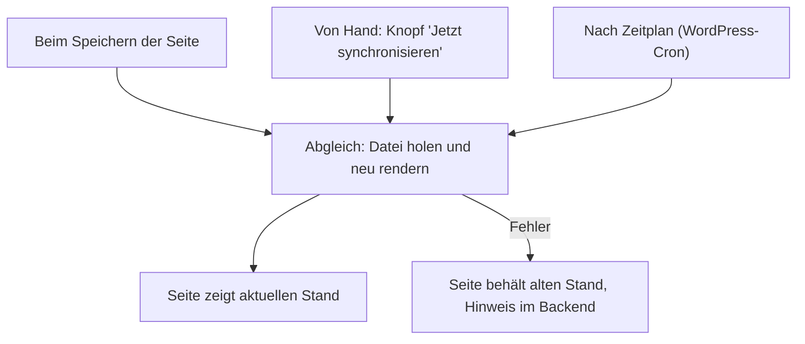

# GitHub-Synchronisation

Eine Seite kann dauerhaft aus einem GitHub-Repository gepflegt werden: Die Markdown-Datei dort ist das Original, WordPress zeigt den jeweils aktuellen Stand. Diese Anleitung richtet das ein und erklärt, wann die Seite aktualisiert wird.

Konzept: Eine Quelle pro Seite

Jede Seite hat eine Quelle: **In WordPress gepflegt** (der Normalfall, ganz normal bearbeitbar) oder **Von GitHub synchronisiert**. Bei einer synchronisierten Seite ist der Inhaltseditor gesperrt, damit niemand Änderungen macht, die der nächste Abgleich überschreiben würde. Eine Spalte in der Seitenliste zeigt die Quelle jeder Seite, und der Block „GitHub-Quellenhinweis“ kann die öffentliche Seite als extern gepflegt kennzeichnen. Dieses Handbuch hier ist selbst so eine synchronisierte Quelle.

## Schritte

1. Öffne die Seite im Editor und suche die Box **Quelle**.
2. Stelle die Quelle auf **Von GitHub synchronisiert**.
3. Trage die Adresse der Markdown-Datei ein (`raw.githubusercontent.com/...`). Aus Sicherheitsgründen sind nur Adressen von erlaubten Hosts über HTTPS zugelassen.
4. Speichere. Schon beim Speichern wird die Datei abgeholt und die Seite neu aufgebaut.

## Ergebnis

Die Seite zeigt den Stand aus dem Repository und aktualisiert sich künftig selbst. Es gibt drei Auslöser:

Den Zeitplan stellst du unter **Handbuch → Einstellungen** ein: aus, stündlich, zweimal täglich, täglich oder wöchentlich (Standard auf einer neuen Installation). „Aus“ heißt nur: kein Zeitplan; beim Speichern und per Knopf wird trotzdem abgeglichen. Ein großes Handbuch wird in Etappen abgeglichen, nie alles auf einmal.

Stolpersteine: Wenn ein Abgleich fehlschlägt

Ein fehlgeschlagener Abgleich leert die Seite nie: Sie behält ihren letzten Stand. Der Fehler wird an der Seite vermerkt, und ein Hinweis im Backend sagt dir, wie viele Seiten betroffen sind. Öffne die Seite und lies in der Box **Quelle** unter „Letzter Abgleich“ den Grund nach, etwa ein GitHub-Limit, einen HTTP-Fehler oder einen nicht erreichbaren Host. Für private Repositories funktioniert der Live-Abgleich nicht; nimm dort den [ZIP-Import](markdown-importieren.md).

Hintergrund: Was gespeichert wird und warum

Synchronisierte Seiten werden als fertig gerendertes, bereinigtes HTML gespeichert, nicht als bearbeitbare Blöcke: Der zeitgesteuerte Abgleich läuft ohne Browser, und nur der Browser kann HTML in Blöcke umwandeln. Es gibt keinen Webhook; WordPress holt die Datei selbst (Pull). Details für Entwickler stehen in der [Entwickler-Dokumentation zum Import und Sync](https://github.com/rfluethi/living-handbook/blob/main/docs/import-and-sync.md).

## Verwandte Seiten

* [Markdown importieren](markdown-importieren.md)
* [Inhalte schreiben](inhalte-schreiben.md)

## Transport-Metadaten
* Seitentyp: Anleitung
* Reihenfolge: 3
* Textauszug: Eine Seite kann dauerhaft aus einem GitHub-Repository gepflegt werden; diese Anleitung richtet das ein und erklärt die drei Auslöser des Abgleichs.
* Letzte Prüfung: 2026-07-23
* Prüfintervall: 90 Tage
