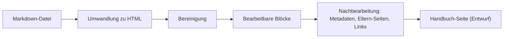

# Markdown importieren

Diese Anleitung bringt bestehende Markdown-Inhalte als Seiten in dein Handbuch: einen eingefügten Entwurf, eine ZIP-Datei oder eine GitHub-Adresse, wahlweise eine einzelne Datei oder ein ganzer Ordner samt Unterordnern.

<details>
<summary>Konzept: Wie der Import arbeitet</summary>

Der Import wandelt Markdown in HTML um und daraus entstehen bearbeitbare Blöcke. Ein ```` ```mermaid ````-Codeblock wird zu einem live gerenderten Diagramm-Block, `<details>`-Abschnitte werden zu Details-Blöcken, und Bilder aus einem `assets`-Ordner werden in die Mediathek geladen. Zum Schluss läuft ein Nachbearbeitungsschritt: Er überträgt die Transport-Metadaten in die Felder der Seite und biegt Eltern-Seiten und interne `.md`-Links auf die richtigen Seiten um.



</details>

## Schritte

1. Öffne **Handbuch → Import**. Jede Quelle hat einen eigenen Reiter mit allem, was sie braucht: Feld, Optionen und ein Import-Knopf.
2. Wähle den passenden Reiter:
   * **Text einfügen:** einen Markdown-Entwurf einfügen, dann **Markdown importieren**. Ein eingefügter Entwurf erzeugt immer eine neue Seite.
   * **ZIP-Datei:** eine ZIP mit `.md`-Dateien hochladen, dann **ZIP importieren**. Die ZIP darf flach sein oder ein MkDocs-Projekt; ein vorhandenes `mkdocs.yml` bestimmt dann Titel, Reihenfolge und Verschachtelung.
   * **GitHub:** eine GitHub-Adresse eintragen, dann **Von GitHub importieren**. Eine Datei-Adresse (`.../blob/...` oder `raw.githubusercontent.com`) importiert eine Seite; eine Ordner-Adresse (`.../tree/...`) importiert alle `.md`-Dateien darunter, Unterordner eingeschlossen.
   * **Paket:** ein Export-Paket von einer anderen Website, siehe [Handbuch umziehen](handbuch-umziehen.md).
   * **App-Handbuch:** lädt genau dieses Handbuch von GitHub, mit einem Klick.
3. Wähle das **Ziel-Handbuch**, in das die Seiten gehören.
4. Starte den Import und lies die Ergebnisliste; sie meldet Warnungen wie eine nicht gefundene Eltern-Seite.
5. Prüfe die entstandenen Seiten und **veröffentliche** sie. Importierte Seiten sind zunächst Entwürfe; nur das App-Handbuch wird direkt veröffentlicht.

> **Screenshot folgt:** Die Import-Seite mit den Reitern (Text einfügen, ZIP-Datei, GitHub, Paket, App-Handbuch), geöffnet ist der GitHub-Reiter mit dem Adressfeld.

## Ergebnis

Für jede Markdown-Datei existiert eine Handbuch-Seite. Bei einem Ordner-Import bildet die Ordnerstruktur die Seitenhierarchie: Ein Ordner mit `index.md` oder `README.md` wird durch diese Datei vertreten, ein Ordner ohne beides bekommt eine automatisch erzeugte Seite mit der Kartenliste seines Inhalts. Die Bereichsseite erhält ihre Adresse vom Ordnernamen, nicht vom Dateinamen `readme`.

## Reihenfolge und erneuter Import

* **Reihenfolge:** Seiten mit einer Zeile `Reihenfolge:` in den Transport-Metadaten werden nach dieser Zahl einsortiert; Seiten ohne Zahl folgen dahinter alphabetisch. Nummeriere also nur, was eine feste Position braucht, mit kleinen Zahlen (1, 2, 3).
* **Erneuter Import derselben Quelle aktualisiert die bestehenden Seiten**, statt Duplikate anzulegen. Adresse und Veröffentlichungsstatus bleiben dabei erhalten; Titel, Inhalt und Eltern-Seite werden aus der Quelle aufgefrischt. Eine von Hand gesetzte Eltern-Seite wird bei einem Ordner-Import zurückgesetzt: Das Repository bestimmt die Struktur.

## Transport-Metadaten: die Feldliste

Jede Datei kann am Ende einen Abschnitt tragen, der beim Import in die Felder der Seite übertragen wird. Erkannt wird die deutsche Überschrift `## Transport-Metadaten`; darüber steht der Seiteninhalt, die erste `#`-Überschrift wird der Titel.

```markdown
## Transport-Metadaten
* Seitentyp: Anleitung
* Verantwortliche Rolle: Handbuch-Redaktion
* Thema: Applikation
* Zielgruppe: Alle Mitglieder, Technik
* Eltern-Seite: Übersicht
* Reihenfolge: 3
* Textauszug: Kurz erklärt.
* Letzte Prüfung: 2026-07-08
* Prüfintervall: 90 Tage
```

Alle Zeilen sind freiwillig. `Zielgruppe` darf mehrere Werte tragen, durch Komma getrennt. `Eltern-Seite` wird über den Titel zugeordnet, nachdem alle Seiten des Imports existieren; die Eltern-Seite darf also später in derselben Lieferung stehen. Mit einer Zeile `Handbuch:` kann eine Datei ihr Ziel-Handbuch selbst bestimmen; sie übersteuert die Auswahl auf der Import-Seite.

<details>
<summary>Stolpersteine: Grenzen des Imports</summary>

* **Höchstens 200 Dateien pro Ordner-Import.** Ist die Grenze erreicht, sagt es die Ergebnisliste; importiere die restlichen Unterordner einzeln.
* **GitHub erlaubt ohne Anmeldung etwa 60 Anfragen pro Stunde.** Ein großer Import kann das Limit erreichen; der Import meldet es, und du versuchst es später erneut. Das Plugin liest nur die Adressen, die du selbst einträgst, und sendet nichts nach draußen.
* **Private Repositories** lassen sich nicht live abrufen. Exportiere sie als ZIP und importiere die Datei; eine MkDocs-Struktur bleibt dabei erhalten.
* **ZIP-Grenzen:** höchstens 2000 Einträge, 5 MB pro Datei, 100 MB entpackt. Die wirkliche Obergrenze bleibt die PHP-Konfiguration deines Servers.

</details>

## Verwandte Seiten

* [Inhalte schreiben](inhalte-schreiben.md)
* [GitHub-Synchronisation](github-synchronisation.md)
* [Handbuch umziehen](handbuch-umziehen.md)
* [Technische Details in der Entwickler-Dokumentation](https://github.com/rfluethi/living-handbook/blob/main/docs/import-and-sync.md)

## Transport-Metadaten
* Seitentyp: Anleitung
* Reihenfolge: 2
* Textauszug: Diese Anleitung bringt bestehende Markdown-Inhalte als Seiten in dein Handbuch: eingefügt, als ZIP-Datei oder von einer GitHub-Adresse.
* Letzte Prüfung: 2026-07-23
* Prüfintervall: 90 Tage
