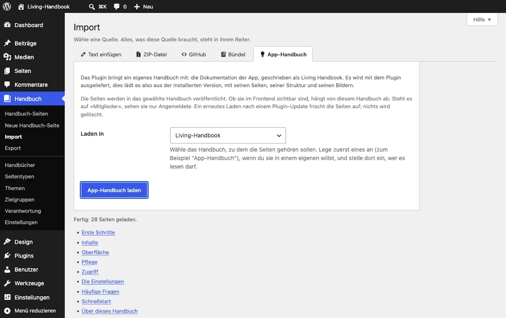

# App-Handbuch laden

Dieses Handbuch ist die Dokumentation von Living Handbook. Du kannst es mit einem Klick in deine eigene Installation laden. Damit hast du die aktuelle Anleitung direkt in WordPress. Zugleich siehst du ein fertiges, gefülltes Handbuch als Beispiel.

Voraussetzungen: Was du brauchst

* Ein Benutzerkonto, das Handbuch-Seiten bearbeiten darf.
* Ein Handbuch als Ziel, zum Beispiel eines mit dem Namen „App-Handbuch“. Lege es vorher an, siehe [Erstes Handbuch anlegen](erstes-handbuch-anlegen.md). Bestimme dort auch, wer es lesen darf.

Das Handbuch liegt im Plugin, du brauchst also keine Internetverbindung, um es zu laden.

## Schritte

1. Öffne **Handbuch → Import** und wechsle auf den Reiter **App-Handbuch**.
2. Wähle unter **Laden in** das Ziel-Handbuch aus.
3. Klicke auf **App-Handbuch laden**.
4. Lies die Ergebnisliste. Sieh dir danach das geladene Handbuch auf der Website an.

## Ergebnis

Alle Seiten dieses Handbuchs stehen jetzt in deinem gewählten Handbuch, samt Navigation und Bildern. Sie sind sofort veröffentlicht. Wer die Seiten sehen darf, bestimmt allein die Sichtbarkeit des Ziel-Handbuchs. Steht es auf „Alle Mitglieder“, lesen nur Angemeldete. Öffentlich wird es erst, wenn du das Handbuch auf „Öffentlich“ stellst.

Konzept: Warum das Handbuch zur Version passt

Das Handbuch wird mit dem Plugin ausgeliefert. Der Reiter **App-Handbuch** lädt es aus dem Plugin selbst, passend zur Sprache deiner WordPress-Verwaltung. So passt die Anleitung immer zur installierten Version, und deine Website braucht dafür kein Internet. Aktualisierst du das Plugin, kommt das passende Handbuch mit; ein erneutes Laden über den Reiter frischt die Seiten dann auf. Geladen wird nie automatisch, nur wenn du es anstößt.

Die Texte werden weiterhin öffentlich auf GitHub geschrieben und beim Erstellen des Plugins hineinkopiert. Wer lieber den neuesten Stand direkt von GitHub zieht, kann den Reiter per Entwickler-Filter dorthin umleiten, siehe die Entwickler-Dokumentation.

Das Handbuch gibt es auf Deutsch und Englisch. Der Reiter wählt die Sprache deiner Verwaltung. Willst du die jeweils andere Sprache, importiere ihren Ordner von Hand über den [GitHub-Import](../inhalte/markdown-importieren.md).

Stolpersteine: Zwei Eigenheiten dieses Imports

* **Die Seiten sind sofort veröffentlicht.** Jeder andere Import legt erst unveröffentlichte Entwürfe an. Hier ist das anders, mit Absicht: Es ist die geprüfte Dokumentation des Plugins, und wer sie sehen darf, regelt ohnehin das Ziel-Handbuch.
* **Ein erneutes Laden überschreibt die Seiten.** Du kannst die geladenen Seiten in WordPress bearbeiten, aber ein erneutes Laden nach einem Plugin-Update ersetzt sie durch die mitgelieferte Fassung. Eigene, dauerhafte Änderungen machst du deshalb besser in einem eigenen Handbuch, nicht in den geladenen App-Handbuch-Seiten.

## Verwandte Seiten

* [Markdown importieren](../inhalte/markdown-importieren.md)
* [GitHub-Synchronisation](../inhalte/github-synchronisation.md)
* [Sichtbarkeit einstellen](../zugriff/sichtbarkeit-einstellen.md)

## Transport-Metadaten
* Seitentyp: Anleitung
* Verantwortliche Rolle: Handbuch-Redaktion
* Thema: Einstieg
* Zielgruppe: Alle Mitglieder
* Eltern-Seite: Erste Schritte
* Reihenfolge: 5
* Textauszug: Dieses Handbuch wird mit dem Plugin ausgeliefert und lässt sich mit einem Klick in deine eigene Installation laden, passend zur installierten Version.
* Letzte Aktualisierung: 2026-08-05
* Letzte Prüfung: 2026-07-23
* Prüfintervall: 90 Tage
