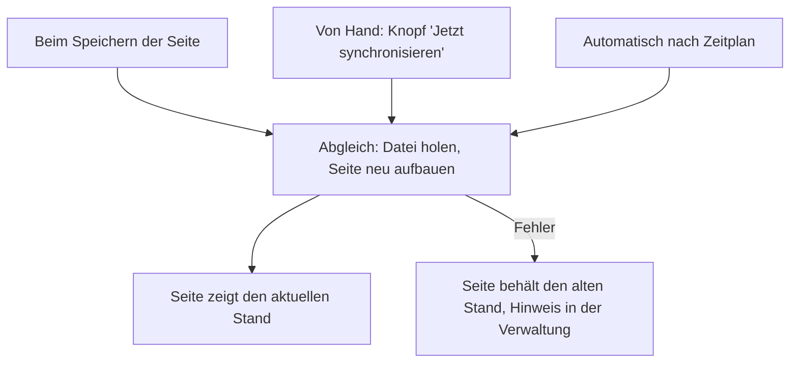

# GitHub-Synchronisation

Eine Seite kann dauerhaft mit einer Markdown-Datei auf GitHub verbunden bleiben. Die Datei dort ist dann das Original. WordPress holt sich Änderungen automatisch und zeigt immer den aktuellen Stand. Diese Anleitung richtet das ein.

Konzept: Jede Seite hat eine Quelle

Der Normalfall ist **In WordPress gepflegt**: Du bearbeitest die Seite direkt in WordPress. Die Alternative ist **Von GitHub synchronisiert**: Die Seite wird aus einer Datei auf GitHub befüllt. Bearbeiten lässt sie sich dann in WordPress nicht mehr, ihr Editor ist gesperrt. Das ist Absicht. Sonst würde der nächste Abgleich deine Änderungen überschreiben. In der Seitenliste zeigt eine eigene Spalte, welche Quelle jede Seite hat.

## Schritte

1. Öffne die Seite im Editor und suche den Kasten **Quelle**.
2. Stelle die Quelle auf **Von GitHub synchronisiert**.
3. Trage die Adresse der Markdown-Datei ein. Sie beginnt mit `raw.githubusercontent.com`. Diese Adresse findest du auf GitHub über den Knopf **Raw** auf der Datei-Ansicht.
4. Speichere. Beim Speichern holt WordPress die Datei sofort ab und baut die Seite neu auf.

## Ergebnis

Die Seite zeigt den Stand der Datei auf GitHub. Künftig aktualisiert sie sich selbst. Es gibt drei Auslöser:

Den Zeitplan stellst du in den [Einstellungen](../die-einstellungen.md) ein: aus, stündlich, zweimal täglich, täglich oder wöchentlich. Auf einer neuen Installation ist wöchentlich eingestellt. „Aus“ heißt nur: kein automatischer Abgleich. Beim Speichern und per Knopf wird trotzdem abgeglichen.

Stolpersteine: Wenn ein Abgleich fehlschlägt

Ein fehlgeschlagener Abgleich leert die Seite nie. Sie behält einfach ihren letzten Stand. In der Verwaltung erscheint ein Hinweis mit der Zahl der betroffenen Seiten. Den Grund findest du auf der Seite selbst, im Kasten **Quelle** unter „Letzter Abgleich“. Häufige Gründe: Die Adresse war falsch oder nicht erreichbar, oder GitHub hat vorübergehend gebremst. Nicht öffentliche GitHub-Projekte lassen sich nicht abrufen. Nimm für sie den [ZIP-Import](markdown-importieren.md).

Hintergrund: Warum die Seite gesperrt ist und wie der Abgleich läuft

WordPress fragt bei GitHub aktiv nach, ob es die Datei noch gibt und was drinsteht. GitHub meldet sich nicht von selbst. Darum gibt es die drei Auslöser oben. Der automatische Abgleich arbeitet in kleinen Portionen. Auch ein großes Handbuch bremst die Website so nicht aus. Technische Details stehen in der [Entwickler-Dokumentation zum Import und Sync](https://github.com/rfluethi/living-handbook/blob/main/docs/import-and-sync.md).

## Verwandte Seiten

* [Markdown importieren](markdown-importieren.md)
* [Inhalte schreiben](inhalte-schreiben.md)

## Transport-Metadaten
* Seitentyp: Anleitung
* Verantwortliche Rolle: Handbuch-Redaktion
* Thema: Inhalte
* Zielgruppe: Alle Mitglieder, Technik
* Eltern-Seite: Inhalte
* Reihenfolge: 3
* Textauszug: Eine Seite kann dauerhaft mit einer Markdown-Datei auf GitHub verbunden bleiben; diese Anleitung richtet das ein.
* Letzte Aktualisierung: 2026-08-05
* Letzte Prüfung: 2026-07-23
* Prüfintervall: 90 Tage
