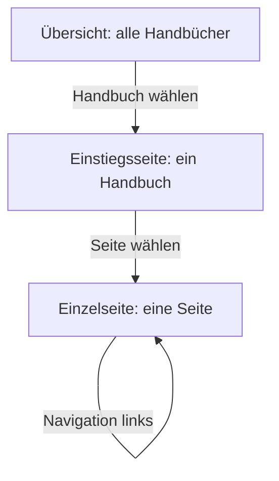

# Die drei Oberflächen

Auf deiner Website besteht ein Handbuch aus drei Arten von Seiten: der Übersicht, der Einstiegsseite und der Einzelseite. Diese Seite erklärt alle drei. Wer sie auseinanderhält, weiß immer, wo eine Anpassung hingehört.

## Worum es geht

Das Diagramm zeigt den Weg der Lesenden: von der Übersicht über die Einstiegsseite eines Handbuchs zur einzelnen Seite.

| Oberfläche | Was sie zeigt | Adresse |
|---|---|---|
| **Übersicht** | Alle Handbücher, die die Besucherin lesen darf: Name, Beschreibung, Seitenzahl. | Frei wählbar, zum Beispiel `/handbuch/`. Die Aktivierung legt die Seite „Handbuch“ an. |
| **Einstiegsseite** | Die Startseite eines Handbuchs: Suche, Filter, Bereichs-Kacheln, zuletzt aktualisierte Seiten. Entsteht automatisch pro Handbuch. | `/handbook-set/<handbuch-name>/` |
| **Einzelseite** | Eine Handbuch-Seite: Navigation, Inhalt, Inhaltsverzeichnis, Abzeichen, Feedback, Metadaten. | `/handbook/<seiten-name>/` |

## Die Einstiegsseite

Die Suche und die Filter grenzen die Seitenliste ein, ohne die Seite neu zu laden. Gefiltert wird nach Seitentyp, Thema, Rolle und Zielgruppe. Ohne JavaScript funktioniert beides als gewöhnliches Formular weiter. Die Bereichs-Kacheln sind die Seiten der obersten Ebene, siehe [Seiten ordnen](../erste-schritte/seiten-ordnen.md).

## Die Einzelseite

Die Seite selbst kommt zuerst: Titel, dann Inhalt. Alles, was über die Seite Auskunft gibt, steht darunter am Fuß: die Feedback-Frage, bei GitHub-Seiten der Herkunftshinweis, die Abzeichen und die Metadaten-Fußzeile. Die Suche des Handbuchs steht links unter der Navigation.

Das Inhaltsverzeichnis rechts baut sich aus den Überschriften der Seite auf. Beim Lesen markiert es den aktuellen Abschnitt. Auf schmalen Bildschirmen erscheint es stattdessen über dem Inhalt. Die Metadaten-Fußzeile zeigt Erstellt, Aktualisiert, Geprüft und die verantwortliche Rolle. Dazu kommt das [Prüfstatus-Abzeichen](../pflege/der-pruefzyklus.md).

## Suchen und Finden

Es gibt zwei Suchen, beide auf das jeweilige Handbuch begrenzt. Die Suche auf der **Einstiegsseite** filtert die Seitenliste; durchsucht werden Titel und Text der Seiten, auch der Inhalt zugeklappter Abschnitte. Das Suchfeld auf einer **Einzelseite** schlägt schon beim Tippen passende Seiten vor, als direkte Links. Beide Suchen zeigen nur Seiten, die die suchende Person lesen darf.

Zwei Grenzen sind gewollt: Die normale WordPress-Suche der Website findet Handbuch-Seiten nicht, dafür gibt es die Handbuch-Suche. Und die Adressen der Handbuch-Seiten (`/handbook/...`, `/handbook-set/...`) sind fest vorgegeben und englisch; ändern lassen sie sich zurzeit nicht.

## Woher die Layouts kommen

Für die Einstiegsseite und die Einzelseite bringt das Plugin fertige Seitenlayouts mit, sogenannte Templates. Alle Bausteine stehen darin schon an der richtigen Stelle. Du kannst die Templates im Website-Editor umbauen, unter **Design → Editor → Templates**. Beispiele: Navigation nach rechts, Inhaltsverzeichnis weg, Inhalt breiter. Die Übersicht ist dagegen eine ganz normale WordPress-Seite. Verschiebe oder ersetze sie nach Belieben.

Hinweis: Templates nach einem Plugin-Update

Sobald du ein Template im Website-Editor speicherst, behält WordPress deine Fassung. Das gilt auch über Plugin-Updates hinweg. Wirkt ein Template nach einem Update veraltet, öffne es im Website-Editor. Wähle dort **Anpassungen zurücksetzen**. Dann gilt wieder die aktuelle Fassung des Plugins.

Hintergrund: Alle Blöcke im Detail

Das Plugin bringt elf eigene Blöcke mit, von der Handbuch-Übersicht bis zum Mermaid-Diagramm. Die meisten rendern nur in ihrem vorgesehenen Zusammenhang. Außerhalb davon geben sie nichts aus. Die vollständige Referenz mit allen Einstellungen steht in der [Entwickler-Dokumentation zu den Blöcken](https://github.com/rfluethi/living-handbook/blob/main/docs/blocks.md).

## Verwandte Seiten

* [Navigation einbinden](navigation-einbinden.md)
* [Gestaltung anpassen](gestaltung-anpassen.md)

## Transport-Metadaten
* Seitentyp: Hintergrund / Konzept
* Verantwortliche Rolle: Handbuch-Redaktion
* Thema: Gestaltung
* Zielgruppe: Alle Mitglieder
* Reihenfolge: 1
* Textauszug: Ein Handbuch besteht auf der Website aus drei Arten von Seiten: der Übersicht, der Einstiegsseite und der Einzelseite; diese Seite erklärt alle drei.
* Letzte Prüfung: 2026-07-23
* Prüfintervall: 180 Tage
