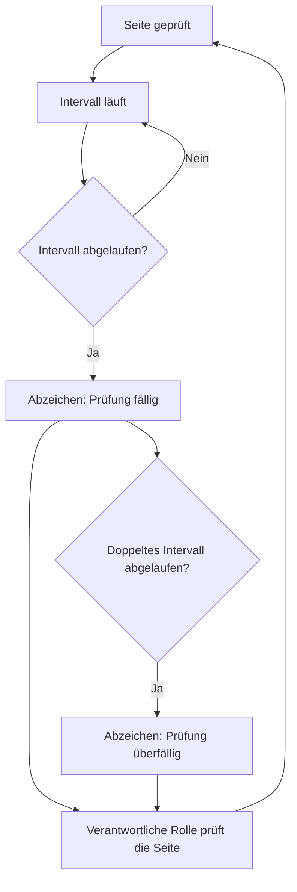

# Der Prüfzyklus

Diese Seite erklärt das Herzstück des Plugins. Jede Seite trägt ein Prüfdatum und ein Prüfintervall. Daraus wird sichtbar, wie verlässlich eine Seite gerade ist. Nichts wird gelöscht und nichts versteckt. Das Handbuch hört bloß auf, so zu tun, als sei eine Seite aktuell.

## Worum es geht

Jede Seite trägt zwei Daten und ein Intervall:

* **Aktualisiert** setzt sich beim Speichern von selbst. Es zeigt den Stand des Inhalts.
* **Geprüft** setzt eine Person von Hand. Es bedeutet: „Ich habe das gelesen, es stimmt noch.“ Das gilt auch, wenn nichts geändert wurde. Nur ein Mensch kann das sagen. Darum setzt es sich nie automatisch.
* **Das Prüfintervall** sagt, wie lange eine Prüfung gilt. Schnelllebiges bekommt ein kurzes Intervall, etwa Tools und externe Dienste. Stabiles bekommt ein langes, etwa Grundsätze und Organisation.

Aus Prüfdatum und Intervall berechnet das Plugin den Status. Er erscheint als Abzeichen unten auf jeder Seite:

Dazu kommt ein vierter Status, **Nicht geprüft**, für Seiten ohne Prüfdatum oder ohne Intervall. Er ist bewusst neutral gefärbt und keine Warnung: Eine Seite, die noch niemand angeschaut hat, ist nicht veraltet, und jede Seite startet hier. Sonst sähe ein frisch importiertes Handbuch am ersten Tag aus wie ein vernachlässigtes. Was dieser Status verlangt, ist keine Prüfung, sondern eine Entscheidung: Prüfdatum und Intervall setzen. Danach nimmt die Seite am Kreislauf teil.

Jeder Status hat neben der Farbe eine eigene Form und eine Beschriftung. Er bleibt darum auch ohne Farbensehen und mit Screenreader erkennbar. Der Punkt von **Nicht geprüft** ist ein leerer Kreis statt eines gefüllten, passend zu einem Feld, das noch niemand ausgefüllt hat.

Das Diagramm zeigt den Kreislauf: Nach der Prüfung läuft das Intervall. Läuft es ab, erscheint das Abzeichen, und die verantwortliche Rolle prüft erneut.

## Warum es so gebaut ist

* **„Fällig“ heißt nicht „falsch“.** Es heißt nur: Niemand hat es in letzter Zeit bestätigt. Nach dem doppelten Intervall eskaliert der Status zu „überfällig“. So altert eine Seite nicht leise vor sich hin.
* **Verantwortung liegt bei Rollen, nicht bei Personen.** Jede Seite nennt eine verantwortliche Rolle. Welche Person die Rolle gerade innehat, pflegt ihr an einer einzigen Stelle außerhalb der Seiten, zum Beispiel auf einer eigenen Seite „Rollen im Team“. Ein Personalwechsel bedeutet darum nicht, hundert Seiten anzufassen. Wie du Rollen anlegst, steht unter [Schlagworte und Rollen pflegen](schlagworte-und-rollen.md).
* **Es gibt keine zentrale Handbuch-Besitzerin.** Die Pflege ist verteilt: Jede Rolle hält ihre Seiten aktuell. Übergreifendes liegt bei einer redaktionellen Rolle, etwa Struktur, Feedback lesen und Stichproben.

## Was das für deine Arbeit bedeutet

**Ein Intervall wählen:** Kurze Intervalle auf Seiten, die sich nie ändern, erzeugen Rauschen. Und Rauschen bringt Leuten bei, Abzeichen zu übersehen. Zwölf Monate sind ein vernünftiger Normalfall. Drei Monate nur dort, wo Veralten wirklich Schaden anrichtet, etwa bei Zugriffsregeln.

**Was eine Prüfung ist:** die Seite lesen und eine Frage stellen: Würde ich das heute noch genauso schreiben? Wenn ja, Datum bestätigen, fertig. Wie das praktisch geht, steht unter [Seiten prüfen](seiten-pruefen.md).

**Der zweite Weg neben dem Zeitplan:** Die gesündeste Pflege ist die anlassbezogene. Ändert sich ein Prozess oder ein Tool, passe die betroffene Seite im selben Arbeitsgang an. Nicht später, nicht als eigene Aufgabe.

Hintergrund: Versionen

Die Seiten leben in WordPress. Die WordPress-Revisionen sind darum die Versionsgeschichte: wer wann was geändert hat. Ein früherer Stand lässt sich wiederherstellen. Ein separates Änderungsprotokoll pro Seite braucht es nicht.

## Verwandte Seiten

* [Seiten prüfen](seiten-pruefen.md)
* [Feedback auswerten](feedback-auswerten.md)

## Transport-Metadaten
* Seitentyp: Hintergrund / Konzept
* Verantwortliche Rolle: Handbuch-Redaktion
* Thema: Pflege
* Zielgruppe: Alle Mitglieder
* Reihenfolge: 1
* Textauszug: Jede Seite trägt Prüfdatum und Prüfintervall; daraus entsteht sichtbar, wie verlässlich eine Seite gerade ist.
* Letzte Prüfung: 2026-08-05
* Prüfintervall: 180 Tage
