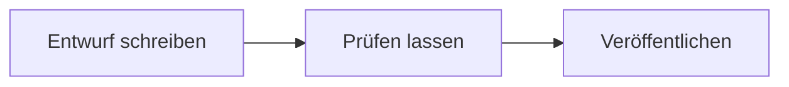

# Die Blöcke des Plugins

Living Handbook bringt eigene Blöcke mit, also Bausteine für den Editor. Du findest sie beim Einfügen unter der Kategorie **Living Handbook**. Diese Seite zeigt, welche du selbst einsetzt und welche das Plugin von allein platziert.

Über die Blöcke bestimmst du, was eine Seite kann. Du kombinierst sie frei mit den normalen WordPress-Blöcken und stellst jeden über seine Einstellungen ein. So gibst du einer Seite genau die Funktion, die sie braucht: ein Diagramm hier, eine seiteninterne Suche dort, eine Abzeichenzeile oder eine Bereichsliste. Wo die Blöcke in den mitgelieferten Seitenlayouts sitzen, legen die Templates fest, die du im Website-Editor umbauen kannst. Eine Handbuch-Seite ist also nichts Starres, sondern auf ihren Zweck zuschneidbar.

## Diese Blöcke setzt du selbst ein

### Mermaid


Zeichnet Diagramme direkt auf der Seite: Abläufe, Entscheidungswege, Hierarchien. Du beschreibst das Diagramm als Text in der Diagramm-Sprache [Mermaid](https://mermaid.js.org/); gezeichnet wird es beim Anzeigen der Seite. Füge den Block ein und schreibe die Beschreibung in das Feld **Mermaid-Code**. Ein Titel wird zur Bildunterschrift. Die Textbeschreibung wird vorgelesen, wenn jemand die Seite mit einem Screenreader nutzt. So sieht die Beschreibung eines kleinen Ablaufs aus:

```text
graph LR;
  A["Entwurf schreiben"] --> B["Prüfen lassen"];
  B --> C["Veröffentlichen"];
```

Und so wird sie gezeichnet:



Der Block funktioniert überall, auch mitten im Seiteninhalt. Kommt eine Seite aus einer Markdown-Datei, brauchst du ihn nicht von Hand zu setzen: Ein Codeblock mit der Sprachangabe `mermaid` wird beim [Import](../inhalte/markdown-importieren.md) automatisch zu diesem Block.

### Handbuch-Übersicht


Listet alle Handbücher, die die aktuelle Besucherin lesen darf, mit Name, Beschreibung und Seitenzahl. Die Aktivierung legt eine Seite mit diesem Block an. Du kannst ihn aber auf jede beliebige Seite setzen. Einstellung: Anzeige als **Liste** oder als **Karten**.

### Handbuch-Menü


Zeigt dieselbe Handbuch-Liste kompakt, gedacht für den Kopfbereich der Website. Auf schmalen Bildschirmen klappt er hinter einem Knopf zusammen. Meist ist die [Einbindung ins Theme-Menü](navigation-einbinden.md) die bessere Wahl; dieser Block ist die Alternative ohne Theme-Menü.

### GitHub-Quellenhinweis


Kennzeichnet eine Seite als [auf GitHub gepflegt](../inhalte/github-synchronisation.md) und verlinkt zusätzlich die Quelldatei auf GitHub, damit Lesende sie dort direkt öffnen können. Der Text des Hinweises ist anpassbar. Der Block zeigt sich nur auf Seiten mit GitHub-Quelle; überall sonst bleibt er unsichtbar. Du kannst ihn also einmal im Seitenlayout platzieren und vergessen.

## Diese Blöcke platziert das Plugin für dich

Die folgenden Blöcke sitzen schon an der richtigen Stelle in den mitgelieferten Seitenlayouts. Du begegnest ihnen nur, wenn du die Layouts im Website-Editor umbaust. Die meisten zeigen zudem nur in ihrem Zusammenhang etwas an; an anderer Stelle bleiben sie leer.

### Handbuch-Eintrag


Baut die Einstiegsseite eines Handbuchs: Suche, Filter, Bereichs-Kacheln und die zuletzt aktualisierten Seiten. Wirkt nur auf der Einstiegsseite.

### Handbuch-Navigation


Zeigt den auf- und zuklappbaren Seitenbaum des Handbuchs. Anzeige als **Menü** (alles offen) oder **Akkordeon** (Äste klappen einzeln). Wirkt auf der Einstiegsseite und auf Einzelseiten.

### Handbuch-Badges


Zeigt die Abzeichen einer Seite: Seitentyp, Thema, Zielgruppe. Wirkt nur auf Einzelseiten.

### Inhaltsverzeichnis


Baut „Auf dieser Seite“ aus den Überschriften der Seite und markiert beim Lesen den aktuellen Abschnitt. Wirkt nur auf Einzelseiten.

### Handbuch-Suche


Ein Suchfeld, das schon beim Tippen passende Seiten des Handbuchs vorschlägt. Wirkt nur auf Einzelseiten.

### Handbuch-Feedback


Stellt die Frage „War das hilfreich?“ mit Ja und Nein. Wirkt nur auf Einzelseiten. Standardmäßig sehen nur angemeldete Personen die Knöpfe; öffentliches Feedback lässt sich in den [Einstellungen](../die-einstellungen.md) einschalten.

### Handbuch-Seiten-Meta


Zeigt Erstellt, Aktualisiert, Geprüft und die verantwortliche Rolle, samt Prüfstatus-Abzeichen. Wirkt nur auf Einzelseiten.

<details>
<summary>Hinweis: Einzelne Blöcke gezielt gestalten</summary>

Jeder Block bietet in der Seitenleiste unter **Erweitert** zwei Felder: eine **zusätzliche CSS-Klasse** und einen **HTML-Anker**. Mit der Klasse gestaltest du genau diesen einen Block, mit dem Anker verlinkst du direkt auf ihn. Die vollständige technische Referenz aller Blöcke steht in der [Entwickler-Dokumentation zu den Blöcken](https://github.com/rfluethi/living-handbook/blob/main/docs/blocks.md).

</details>

## Verwandte Seiten

* [Die drei Oberflächen](die-drei-oberflaechen.md)
* [Navigation einbinden](navigation-einbinden.md)
* [Inhalte schreiben](../inhalte/inhalte-schreiben.md)

## Transport-Metadaten
* Seitentyp: Tool-Übersicht
* Verantwortliche Rolle: Handbuch-Redaktion
* Thema: Gestaltung
* Zielgruppe: Alle Mitglieder
* Reihenfolge: 2
* Textauszug: Welche Blöcke des Plugins du selbst einsetzt, allen voran das Mermaid-Diagramm, und welche das Plugin von allein platziert.
* Letzte Prüfung: 2026-07-23
* Prüfintervall: 180 Tage
