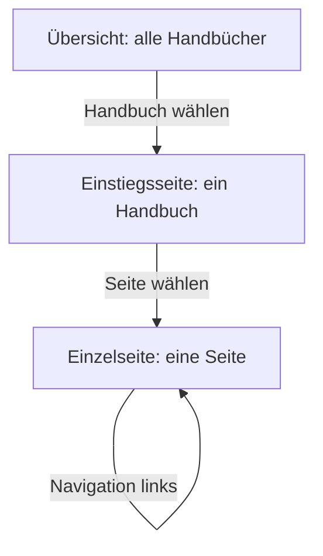
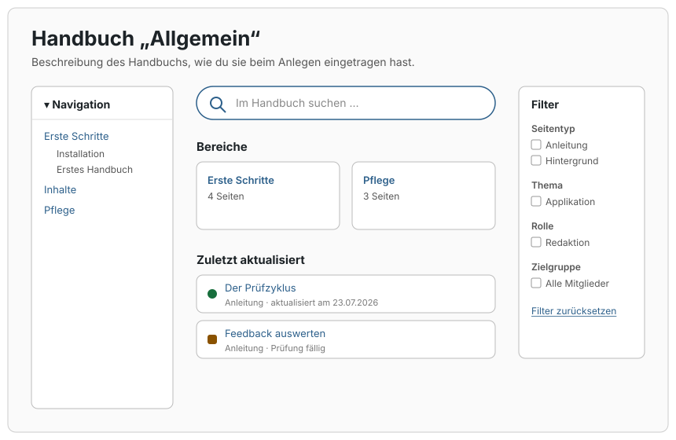
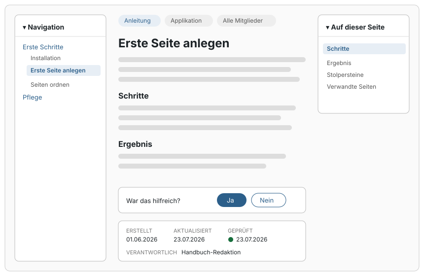

# Die drei Oberflächen

Diese Seite erklärt die drei Seiten-Arten, aus denen ein Handbuch im Frontend besteht: die Übersicht, die Einstiegsseite und die Einzelseite. Wer sie auseinanderhält, weiß immer, wo eine Anpassung hingehört.

## Worum es geht

| Oberfläche | Was sie zeigt | Adresse |
|---|---|---|
| **Übersicht** | Alle Handbücher, die die Besucherin lesen darf: Name, Beschreibung, Seitenzahl. | Frei wählbar, zum Beispiel `/handbuch/`. Die Aktivierung legt die Seite „Handbuch“ an. |
| **Einstiegsseite** | Die Startseite eines Handbuchs: Suche, Filter, Bereichs-Kacheln, zuletzt aktualisierte Seiten. Entsteht automatisch pro Handbuch. | `/handbook-set/<handbuch-name>/` |
| **Einzelseite** | Eine Handbuch-Seite: Navigation, Inhalt, Inhaltsverzeichnis, Abzeichen, Feedback, Metadaten. | `/handbook/<seiten-name>/` |

## Die Einstiegsseite

Die Suche und die Filter (Seitentyp, Thema, Rolle, Zielgruppe) grenzen die Seitenliste ein, ohne die Seite neu zu laden; ohne JavaScript funktionieren sie als gewöhnliches Formular weiter. Die Bereichs-Kacheln sind die Seiten der obersten Ebene, siehe [Seiten ordnen](../erste-schritte/seiten-ordnen.md).

## Die Einzelseite

Das Inhaltsverzeichnis rechts baut sich aus den Überschriften der Seite auf und markiert beim Lesen den aktuellen Abschnitt; auf schmalen Bildschirmen erscheint es stattdessen über dem Inhalt. Die Metadaten-Fußzeile zeigt Erstellt, Aktualisiert, Geprüft und die verantwortliche Rolle, samt [Prüfstatus-Abzeichen](../pflege/der-pruefzyklus.md).

## Woher die Layouts kommen

Einstiegsseite und Einzelseite bringen fertige Block-Templates mit, die alle Blöcke bereits an der richtigen Stelle platzieren. Du kannst sie im Website-Editor unter **Design → Editor → Templates** umbauen: Navigation nach rechts, Inhaltsverzeichnis weg, Inhalt breiter. Die Übersicht ist dagegen eine ganz normale Seite mit dem Übersichts-Block; verschiebe oder ersetze sie nach Belieben.

Hinweis: Templates nach einem Plugin-Update

Sobald du ein Template im Website-Editor speicherst, behält WordPress deine Fassung, auch über Plugin-Updates hinweg. Wirkt ein Template nach einem Update veraltet, öffne es im Website-Editor und wähle **Anpassungen zurücksetzen**; dann gilt wieder die aktuelle Fassung des Plugins.

Hintergrund: Alle Blöcke im Detail

Das Plugin bringt elf eigene Blöcke mit, von der Handbuch-Übersicht bis zum Mermaid-Diagramm. Die meisten rendern nur in ihrem vorgesehenen Zusammenhang; außerhalb davon geben sie nichts aus. Die vollständige Referenz mit allen Einstellungen steht in der [Entwickler-Dokumentation zu den Blöcken](https://github.com/rfluethi/living-handbook/blob/main/docs/blocks.md).

## Verwandte Seiten

* [Navigation einbinden](navigation-einbinden.md)
* [Gestaltung anpassen](gestaltung-anpassen.md)

## Transport-Metadaten
* Seitentyp: Hintergrund/Konzept
* Reihenfolge: 1
* Textauszug: Ein Handbuch besteht im Frontend aus drei Seiten-Arten: der Übersicht, der Einstiegsseite und der Einzelseite; diese Seite erklärt alle drei.
* Letzte Prüfung: 2026-07-23
* Prüfintervall: 180 Tage
