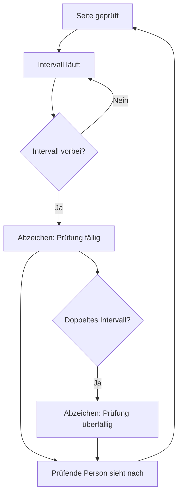

# Der Prüfzyklus

Jede Seite trägt ein Prüfintervall. Läuft es ab, zeigt die Seite ein Abzeichen und erscheint im Dashboard-Widget. Nichts wird gelöscht und nichts versteckt: Das Handbuch hört bloss auf, so zu tun, als sei die Seite aktuell.

## Ein Intervall wählen

Kurze Intervalle auf Seiten, die sich nie ändern, erzeugen Rauschen, und Rauschen bringt Leuten bei, Abzeichen zu übersehen. Zwölf Monate sind ein vernünftiger Normalfall. Drei Monate nur dort, wo Veralten wirklich Schaden anrichtet, etwa bei Zugriffsregeln.

## Was eine Prüfung ist

Die Seite lesen und eine Frage stellen: Würde ich das heute noch genauso schreiben? Wenn ja, Datum bestätigen und fertig.

## Transport-Metadaten
* Reihenfolge: 1
* Letzte Prüfung: 2026-06-01
* Prüfintervall: 180 Tage
