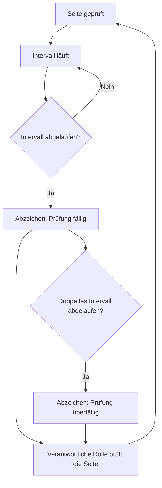

# Der Prüfzyklus

Diese Seite erklärt die Idee hinter dem Herzstück des Plugins: Jede Seite trägt ein Prüfdatum und ein Prüfintervall, und daraus entsteht sichtbar, wie verlässlich eine Seite gerade ist. Nichts wird gelöscht und nichts versteckt: Das Handbuch hört bloß auf, so zu tun, als sei eine Seite aktuell.

## Worum es geht

Jede Seite trägt zwei Daten und ein Intervall:

* **Aktualisiert** setzt sich beim Speichern von selbst; es zeigt den Stand des Inhalts.
* **Geprüft** setzt eine Person von Hand. Es bedeutet: „Ich habe das gelesen, es stimmt noch“, auch wenn nichts geändert wurde. Nur ein Mensch kann das sagen, darum setzt es sich nie automatisch.
* **Das Prüfintervall** sagt, wie lange eine Prüfung gilt. Schnelllebiges (Tools, externe Dienste) bekommt ein kurzes Intervall, Stabiles (Grundsätze, Organisation) ein langes.

Aus Prüfdatum und Intervall berechnet das Plugin den Status und zeigt ihn als Abzeichen in der Metadaten-Fußzeile jeder Seite:

Jeder Status hat neben der Farbe eine eigene Form und eine Beschriftung; er bleibt also auch ohne Farbensehen und mit Screenreader erkennbar.

## Warum es so gebaut ist

* **„Fällig“ heißt nicht „falsch“.** Es heißt nur: Niemand hat es in letzter Zeit bestätigt. Die Eskalation zu „überfällig“ nach dem doppelten Intervall sorgt dafür, dass eine Seite nicht leise vor sich hin altert.
* **Verantwortung liegt bei Rollen, nicht bei Personen.** Jede Seite nennt eine verantwortliche Rolle; welche Person die Rolle gerade innehat, wird an einer einzigen Stelle gepflegt. Ein Personalwechsel bedeutet darum nicht, hundert Seiten anzufassen.
* **Es gibt keine zentrale Handbuch-Besitzerin.** Die Pflege ist verteilt: Jede Rolle hält ihre Seiten aktuell. Übergreifendes (Struktur, Feedback lesen, Stichproben) liegt bei einer redaktionellen Rolle.

## Was das für deine Arbeit bedeutet

**Ein Intervall wählen:** Kurze Intervalle auf Seiten, die sich nie ändern, erzeugen Rauschen, und Rauschen bringt Leuten bei, Abzeichen zu übersehen. Zwölf Monate sind ein vernünftiger Normalfall; drei Monate nur dort, wo Veralten wirklich Schaden anrichtet, etwa bei Zugriffsregeln.

**Was eine Prüfung ist:** die Seite lesen und eine Frage stellen: Würde ich das heute noch genauso schreiben? Wenn ja, Datum bestätigen, fertig. Wie das praktisch geht, steht unter [Seiten prüfen](seiten-pruefen.md).

**Der zweite Weg neben dem Zeitplan:** Die gesündeste Pflege ist die anlassbezogene. Ändert sich ein Prozess oder ein Tool, wird die betroffene Seite im selben Arbeitsgang angepasst, nicht später als eigene Aufgabe.

Hintergrund: Versionen

Weil die Seiten in WordPress leben, sind die WordPress-Revisionen die Versionsgeschichte: wer wann was geändert hat, mit der Möglichkeit, einen früheren Stand wiederherzustellen. Ein separates Änderungsprotokoll pro Seite braucht es nicht.

## Verwandte Seiten

* [Seiten prüfen](seiten-pruefen.md)
* [Feedback auswerten](feedback-auswerten.md)

## Transport-Metadaten
* Seitentyp: Hintergrund/Konzept
* Reihenfolge: 1
* Textauszug: Jede Seite trägt Prüfdatum und Prüfintervall; daraus entsteht sichtbar, wie verlässlich eine Seite gerade ist.
* Letzte Prüfung: 2026-07-23
* Prüfintervall: 180 Tage
