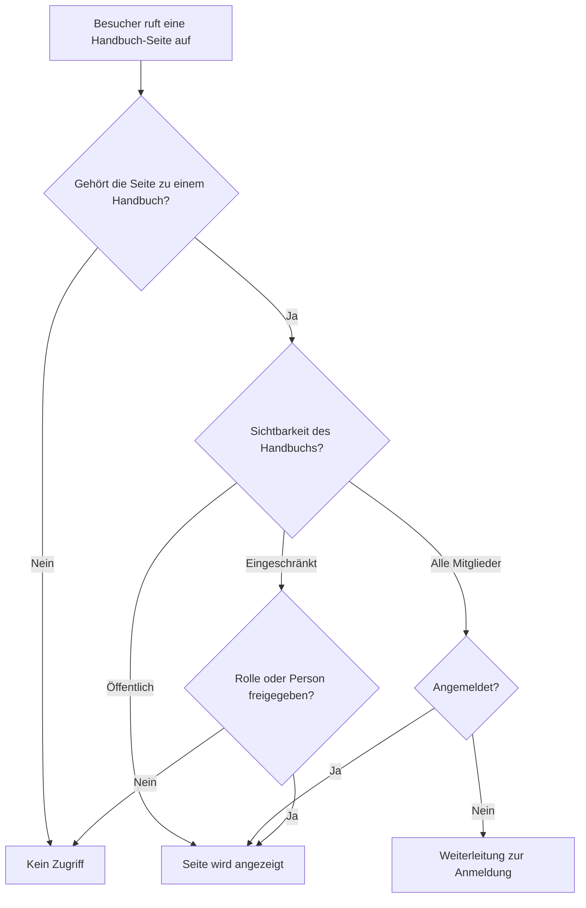

# Zugriff verstehen

Diese Seite beantwortet die Frage: Warum zeigt Living Handbook im Zweifel lieber nichts an, als versehentlich etwas preiszugeben? Wer dieses Prinzip kennt, versteht jedes „Warum sehe ich nichts?“ sofort.

## Worum es geht

Ein internes Handbuch enthält Dinge, die nicht öffentlich sein sollen: Abläufe, Zuständigkeiten, interne Adressen. Der teuerste Fehler eines solchen Systems ist nicht eine unsichtbare Seite, sondern eine versehentlich öffentliche. Living Handbook ist darum **fail-closed** gebaut: Im Zweifel wird versteckt.

## Warum es so gebaut ist

* **Eine Regel pro Handbuch statt pro Seite:** Sichtbarkeit pro Seite klingt flexibel, wird aber unübersichtlich; niemand kann hundert Einzelregeln im Kopf behalten. Eine Regel pro Handbuch kannst du in einem Satz aussprechen: „Das Team-Handbuch sehen alle Angemeldeten.“
* **Eine Seite ohne Handbuch ist unsichtbar:** Sie hat keine Regel, die Zugriff erlauben könnte, also gilt die sichere Antwort: kein Zugriff. Das ist die häufigste Ursache für „meine Seite erscheint nicht“, siehe [Häufige Fragen](../haeufige-fragen.md).
* **Ein zentraler Prüfpunkt:** Jede Stelle, die Handbuch-Inhalte ausliefert (Einzelseite, Suche, Filter, Menü, Feedback, Schnittstellen), stellt dieselbe Frage an dieselbe zentrale Prüfung. Es gibt keine Hintertür, die vergessen gehen könnte.
* **Auch die Nebenwege sind geschlossen:** Handbuch-Seiten erscheinen nicht in der XML-Sitemap, nicht in Feeds und nicht in Vorschau-Einbettungen. Ein internes Handbuch hinterlässt keine öffentlichen Spuren.

## Was das für deine Arbeit bedeutet

* Ein neues Handbuch startet auf **Alle Mitglieder**; öffentlich wird es nur durch deine bewusste Entscheidung.
* Ein importiertes Handbuch startet ebenfalls auf **Alle Mitglieder**, egal was die Quelle sagt.
* Wenn etwas nicht erscheint, ist das fast nie ein Fehler, sondern die Schutzlogik. Prüfe Handbuch-Zuweisung und Sichtbarkeit, bevor du weitersuchst.

Hintergrund: Für Entwicklerinnen und Entwickler

Die zentrale Prüfung ist filterbar, etwa um einem Dienstkonto Lesezugriff auf alles zu geben. Wie das geht und warum eigene Lesepfade immer durch diese Prüfung führen müssen, steht in der [Entwickler-Dokumentation zu den Hooks](https://github.com/rfluethi/living-handbook/blob/main/docs/hooks.md).

## Verwandte Seiten

* [Sichtbarkeit einstellen](sichtbarkeit-einstellen.md)
* [Häufige Fragen](../haeufige-fragen.md)

## Transport-Metadaten
* Seitentyp: Hintergrund/Konzept
* Reihenfolge: 2
* Textauszug: Living Handbook versteckt im Zweifel lieber, als versehentlich etwas preiszugeben; diese Seite erklärt das Fail-closed-Prinzip.
* Letzte Prüfung: 2026-07-23
* Prüfintervall: 365 Tage
