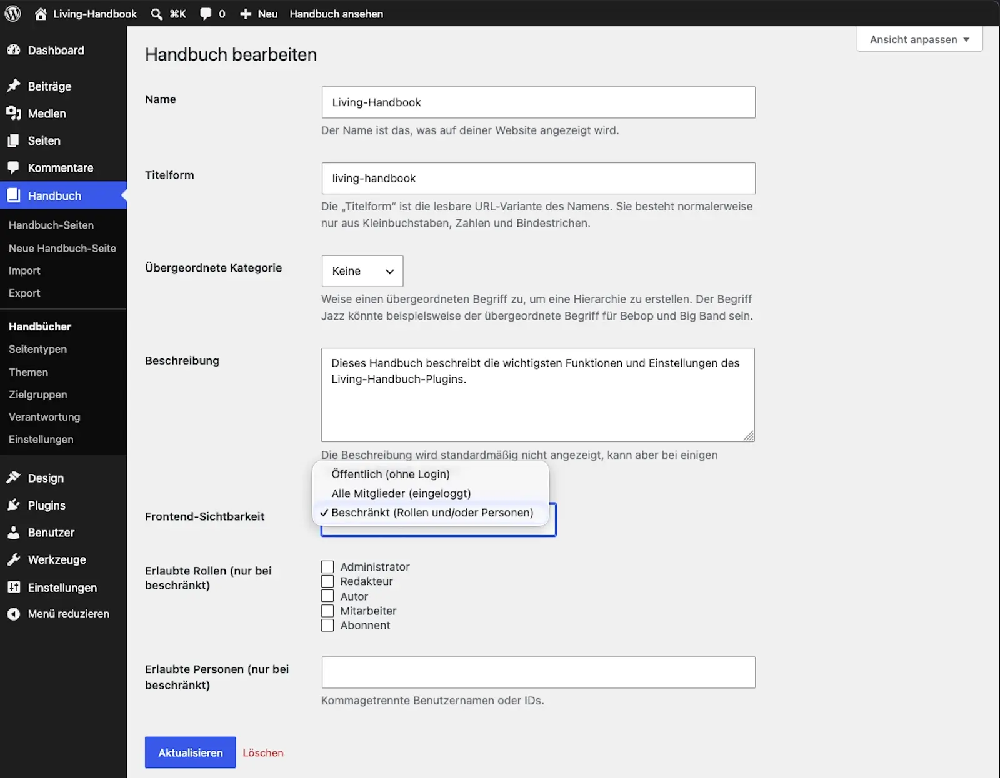

# Set visibility

Visibility is controlled per handbook, not per page. This guide sets who may read a handbook on the website.

## Steps

1. Open **Handbook → Handbooks** and edit the handbook.
2. Choose one of the three levels:
   * **Public:** Everyone can read, even without logging in.
   * **All members (logged in):** Only people logged in to the website can read. This is the default for every new handbook.
   * **Restricted:** Only specific user roles and/or individually named people can read.
3. For **Restricted**: pick the roles. Add individual people if needed.
4. Save.

## Result

The rule takes effect immediately and everywhere: on the handbook overview, on the pages, in the search, in the filters and in the menu. A handbook someone may not read appears nowhere for that person, not even as a name in a list. Logged-in people without permission see "page not found". Logged-out people are sent to the login.

Pitfalls: Typical surprises

* **"I cannot see my handbook":** You are probably logged out, and the handbook is set to "All members". Test your readers' view in a private browser window.
* **Visibility only applies to the website.** Who may work in the WordPress admin and edit pages is still governed by the normal WordPress user roles.
* **When moving to another website, individually allowed people do not travel along.** See [Move a handbook](../content/move-a-handbook.md).

## Related pages

* [Understanding access](understanding-access.md)
* [Create your first handbook](../getting-started/create-your-first-handbook.md)

## Transport-Metadaten
* Seitentyp: Guide
* Verantwortliche Rolle: Handbook editors
* Thema: Access
* Zielgruppe: All members
* Reihenfolge: 1
* Textauszug: Visibility is controlled per handbook; this guide sets who may read a handbook on the website.
* Letzte Prüfung: 2026-07-27
* Prüfintervall: 90 Tage
