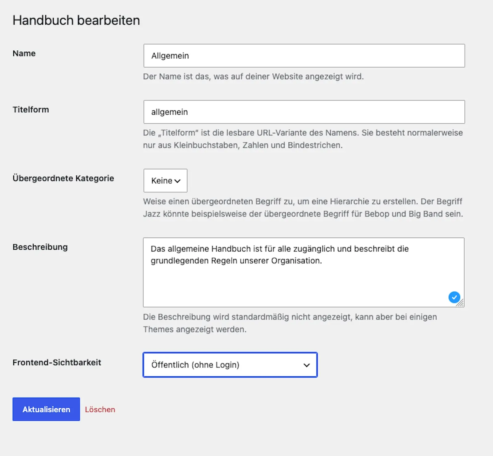

# Create your first handbook

A handbook is the container for your pages. It decides who may read them. It also gets its own entry page with search and filters. This guide creates your first handbook.

Concept: Why the container comes first

Every handbook page belongs to exactly one handbook. Who may read what is controlled per handbook, not per page. A page without a handbook therefore has no rule that could allow reading. It stays invisible on the website. That is why you create the handbook first and the pages after. More under [Understanding access](../access/understanding-access.md).

## Steps

1. Open **Handbook → Handbooks** and create a new handbook.
2. Enter a **name**, for example "General". Add a short **description**. It appears later on the overview and the entry page.
3. On the same screen, set the **visibility**. There are three levels: **Public** for all visitors, **All members (logged in)** for an internal handbook, or **restricted** to specific user roles and people.
4. Save.

## Result

The new handbook appears in the list under **Handbook → Handbooks**. It also appears on the "Handbook" overview page, provided the current visitor may see it. Its entry page sits automatically at `/handbook-set/<name>/`. It fills up as soon as you create pages.

Pitfalls: Visibility is strict on purpose

A new handbook starts on **All members (logged in)**. Logged out, you see nothing. That only changes when you set it to **Public** or grant roles and people. This is deliberate: the plugin would rather hide a page than publish it by accident. If you see nothing while testing, check the visibility first. Use a private browser window for that. More under [Set visibility](../access/set-visibility.md).

## Related pages

* [Create your first page](create-your-first-page.md)
* [Set visibility](../access/set-visibility.md)

## Transport-Metadaten
* Seitentyp: Guide
* Verantwortliche Rolle: Handbook editors
* Thema: Getting started
* Zielgruppe: All members
* Reihenfolge: 2
* Textauszug: A handbook is the container for your pages; this guide creates your first handbook and sets its visibility.
* Letzte Prüfung: 2026-07-27
* Prüfintervall: 180 Tage
