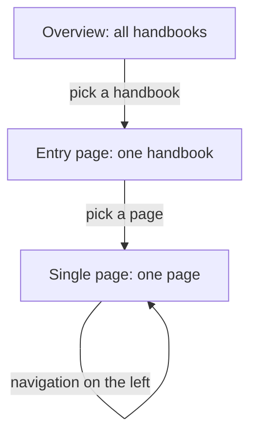
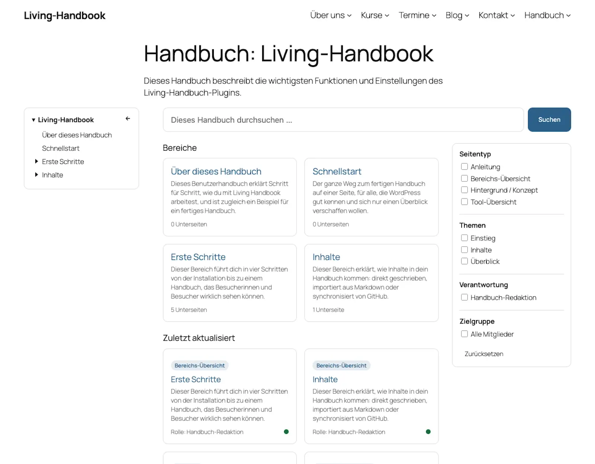
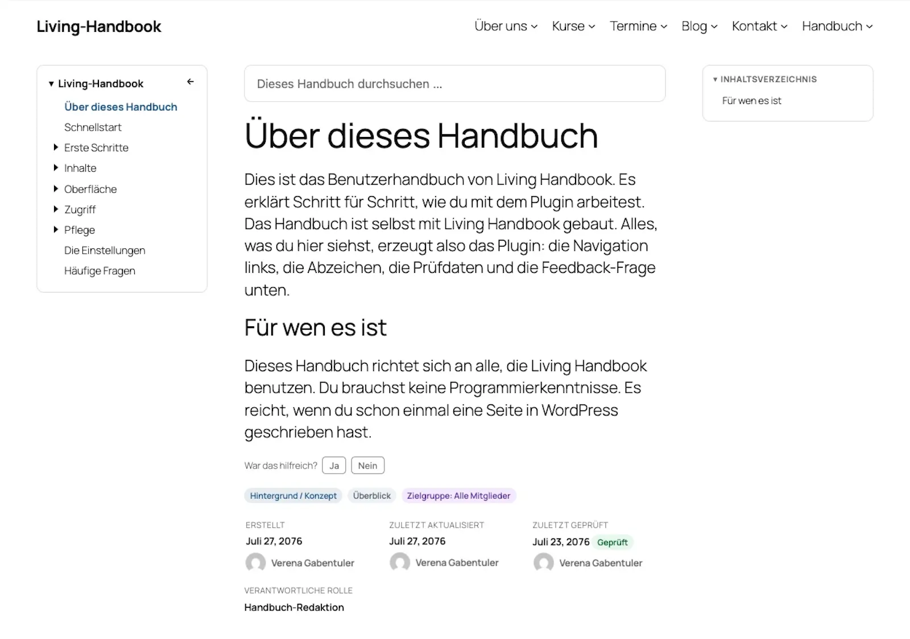

# The three surfaces

On your website, a handbook consists of three kinds of pages: the overview, the entry page and the single page. This page explains all three. Once you can tell them apart, you always know where an adjustment belongs.

## What this is about

The diagram shows the readers' path: from the overview through a handbook's entry page to the single page.

| Surface | What it shows | Address |
|---|---|---|
| **Overview** | All handbooks the visitor may read: name, description, page count. | Your choice, for example `/handbook/`. Activation creates the "Handbook" page. |
| **Entry page** | The start page of one handbook: search, filters, area tiles, recently updated pages. Created automatically per handbook. | `/handbook-set/<handbook-name>/` |
| **Single page** | One handbook page: navigation, content, table of contents, badges, feedback, page details. | `/handbook/<page-name>/` |

## The entry page

The search and the filters narrow the page list down without reloading the page. Filtering works by page type, topic, role and audience. Without JavaScript, both keep working as an ordinary form. The area tiles are the top-level pages, see [Organise pages](../getting-started/organise-pages.md).

## The single page

The table of contents on the right builds itself from the page's headings. While you read, it highlights the current section. On narrow screens it appears above the content instead. The footer shows Created, Last updated, Last reviewed and the responsible role. Next to it sits the [review-status badge](../upkeep/the-review-cycle.md).

## Searching and finding

There are two searches, both limited to the current handbook. The search on the **entry page** filters the page list; it covers the title and the text of the pages, including the content of collapsed sections. The search field on a **single page** suggests matching pages as you type, as direct links. Both searches only show pages the searching person may read.

Two limits are intentional: the normal WordPress site search does not find handbook pages; the handbook search exists for that. And the addresses of the handbook pages (`/handbook/...`, `/handbook-set/...`) are fixed and cannot currently be changed.

## Where the layouts come from

For the entry page and the single page the plugin ships finished page layouts, so-called templates. All building parts already sit in the right place. You can rebuild the templates in the Site Editor, under **Appearance → Editor → Templates**. Examples: navigation to the right, drop the table of contents, widen the content. The overview, by contrast, is an entirely normal WordPress page. Move or replace it as you like.

Tip: Templates after a plugin update

As soon as you save a template in the Site Editor, WordPress keeps your version. That holds across plugin updates too. If a template looks outdated after an update, open it in the Site Editor. Choose **Clear customizations** there. Then the plugin's current version applies again.

Background: All blocks in detail

The plugin ships eleven blocks of its own, from the handbook overview to the Mermaid diagram. Most only render in their intended context. Anywhere else they output nothing. The full reference with every setting is in the [developer documentation on the blocks](https://github.com/rfluethi/living-handbook/blob/main/docs/blocks.md).

## Related pages

* [Add handbooks to your menu](add-to-the-menu.md)
* [Customize the design](customize-the-design.md)

## Transport-Metadaten
* Seitentyp: Background / Concept
* Verantwortliche Rolle: Handbook editors
* Thema: Design
* Zielgruppe: All members
* Reihenfolge: 1
* Textauszug: On the website a handbook consists of three kinds of pages: the overview, the entry page and the single page; this page explains all three.
* Letzte Prüfung: 2026-07-27
* Prüfintervall: 180 Tage
