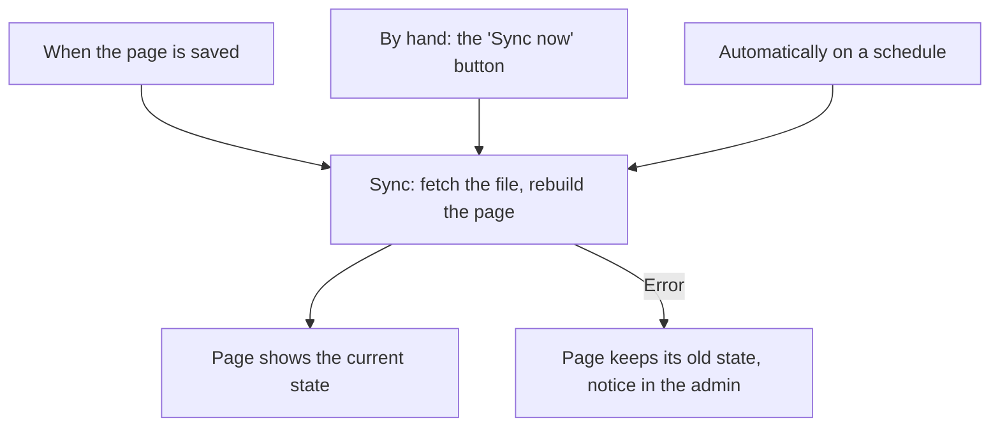

# GitHub sync

A page can stay permanently connected to a Markdown file on GitHub. The file there is the original. WordPress fetches changes automatically and always shows the current state. This guide sets that up.

Concept: Every page has a source

The normal case is **Maintained in WordPress**: you edit the page directly in WordPress. The alternative is **Synced from GitHub**: the page is filled from a file on GitHub. It can then no longer be edited in WordPress; its editor is locked. That is deliberate. Otherwise the next sync would overwrite your changes. In the page list, a dedicated column shows each page's source.

## Steps

1. Open the page in the editor and find the **Source** box.
2. Set the source to **Synced from GitHub**.
3. Enter the address of the Markdown file. It starts with `raw.githubusercontent.com`. You find this address on GitHub through the **Raw** button on the file view.
4. Save. On saving, WordPress fetches the file right away and rebuilds the page.

## Result

The page shows the state of the file on GitHub. From now on it updates itself. There are three triggers:

You set the schedule in [the settings](../the-settings.md): off, hourly, twice daily, daily or weekly. On a fresh installation it is weekly. "Off" only means: no automatic sync. Saving and the button still sync.

Pitfalls: When a sync fails

A failed sync never empties the page. It simply keeps its last state. A notice in the admin tells you how many pages are affected. You find the reason on the page itself, in the **Source** box under "Last sync". Common reasons: the address was wrong or unreachable, or GitHub throttled temporarily. Private GitHub projects cannot be fetched. Use the [ZIP import](import-markdown.md) for them.

Background: Why the page is locked and how the sync runs

WordPress actively asks GitHub whether the file still exists and what it contains. GitHub does not call in on its own. That is why there are the three triggers above. The automatic sync works in small batches. Even a large handbook does not slow the website down. Technical details are in the [developer documentation on import and sync](https://github.com/rfluethi/living-handbook/blob/main/docs/import-and-sync.md).

## Related pages

* [Import Markdown](import-markdown.md)
* [Writing content](writing-content.md)

## Transport-Metadaten
* Seitentyp: Guide
* Verantwortliche Rolle: Handbook editors
* Thema: Content
* Zielgruppe: All members, Tech
* Eltern-Seite: Content
* Reihenfolge: 3
* Textauszug: A page can stay permanently connected to a Markdown file on GitHub; this guide sets that up.
* Letzte Aktualisierung: 2026-08-05
* Letzte Prüfung: 2026-07-27
* Prüfintervall: 90 Tage
