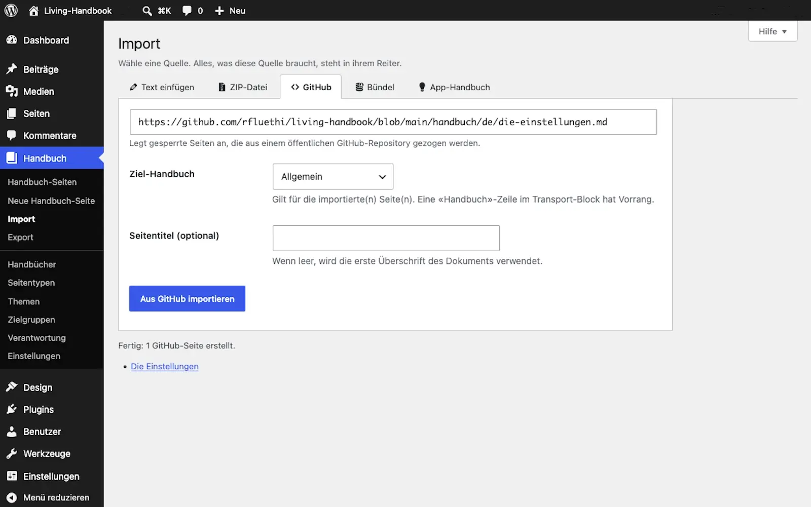

# Import Markdown

This guide brings finished Markdown texts into your handbook as pages. There are three sources: pasted text, a ZIP file with Markdown files, or an address on GitHub. What Markdown and GitHub are is explained in the [overview of the Content area](README.md).

<details>
<summary>Concept: What happens during an import</summary>

The import reads each Markdown file and builds a normal handbook page from it. Afterwards the page can be edited in WordPress like any other. Headings, lists, images, diagrams and collapsible sections survive. Links between the files become links between the finished pages. Exactly what survives is under [Writing content](writing-content.md).

</details>

## Steps

1. Open **Handbook → Import**. Each source has its own tab with everything it needs.
2. Choose the matching tab:
   * **Paste text:** Paste a Markdown text and click **Import Markdown**. This always creates a new page.
   * **ZIP file:** Upload a ZIP file with Markdown files and click **Import ZIP**.
   * **GitHub:** Enter a GitHub address and click **Import from GitHub**. If the address points at a single file, one page is created. If it points at a folder, every Markdown file in it is imported, subfolders included.
   * **Bundle:** Take over a whole handbook from another website, see [Move a handbook](move-a-handbook.md).
   * **App handbook:** Load this very handbook, see [Load the app handbook](../getting-started/load-the-app-handbook.md).
3. Choose the **target handbook** the pages belong to.
4. Start the import and read the result list. It reports what was created and where something was missing.
5. Check the new pages and **publish** them. Imported pages start as unpublished drafts. Nothing goes online unchecked. The one exception is the app handbook, which appears immediately.



## Folders become areas

When you import a whole folder, the folder structure becomes the handbook structure. Every subfolder becomes an area. Every file becomes a page in its area. The navigation builds itself.

Each area needs a start page. The import solves that like this:

* If the folder holds a file called `index.md` or `README.md`, that file becomes the area's start page. The other pages of the folder are placed under it.
* If there is no such file, the import creates the start page itself. It automatically shows a list of all pages in the area.

A large folder import does not fit into a single request, so it works in passes: it imports as many pages as it manages in the time available and then carries on by itself. The pages appear in the result list as they arrive. Right at the end it checks the links between the pages, because a link can only be resolved once its target page exists. While the message "checking the links on …" is running, the import is not finished. Leave the window open until the closing message appears.

## The data sheet at the end of a file: transport metadata

Every handbook page carries details such as page type, audience or review date. In WordPress you enter them into fields. A Markdown file has no such fields. That is why every file may carry a short data sheet at the end. It is called **transport metadata**. The import reads it, fills the page's fields with it, and removes it from the text.

The data sheet starts with a level-two heading that reads exactly "Transport-Metadaten". This label is German and fixed, whatever language the handbook is written in; the importer only recognises this exact heading. From this heading, everything to the end of the file counts as the data sheet. Below it comes a list; every line is optional:

```markdown
* Seitentyp: Guide
* Verantwortliche Rolle: Handbook editors
* Thema: Application
* Zielgruppe: All members, Tech
* Eltern-Seite: Overview
* Reihenfolge: 2
* Textauszug: Explained in short.
* Letzte Prüfung: 2026-07-08
* Prüfintervall: 90 Tage
```

The line labels are German too, and fixed. The values behind them are yours: term names in your handbook's language, the page title of the parent, your excerpt text.

**Important:** As of plugin version 0.43, the heading "Transport-Metadaten" may also appear in examples and code blocks. The import skips code blocks and takes the last occurrence outside of them. Older versions instead split at the first occurrence; there, a second occurrence cuts off the rest of the page. That is why the heading is missing from the example above.

Three lines deserve an explanation:

* **Eltern-Seite** (parent page) places the page under another page, named by its title. The parent may come later in the same import; the matching happens at the end.
* **Reihenfolge** (order) sets the position in the menu. Small numbers sit at the top. Pages without a number follow behind, alphabetically. So only number what needs a fixed position.
* **Handbuch** (handbook) may be added as well. With it the file picks its own target handbook and overrides the choice on the import screen.

## Importing the same source again

A second import of the same source creates no copies. It updates the existing pages. Their address stays the same. A published page stays published. Title, content and placement are refreshed from the source. There is one exception with the folder import: it also restores the structure. If you changed a parent page by hand, that is reset. For imported handbooks, organise in the files instead, through the "Reihenfolge" line.

<details>
<summary>Pitfalls: Limits of the import</summary>

* **At most 200 files per folder import.** If the limit is reached, the result list says so. Import the remaining subfolders separately afterwards.
* **GitHub throttles after about 60 requests per hour.** A very large import can hit that limit. It then stops on a whole page and reports how many pages it managed and from when it can continue. Nothing is lost: simply start the import again afterwards, pages that already exist are updated, not duplicated. From about twenty files on, the import downloads the project once as an archive instead of fetching every file separately, so the limit is usually not reached at all.
* **Private GitHub projects** cannot be fetched directly. Download the files there as a ZIP and import the ZIP file.
* **ZIP limits:** at most 2000 files, 5 MB per file, 100 MB uncompressed.

</details>

## Related pages

* [Writing content](writing-content.md)
* [GitHub sync](github-sync.md)
* [Move a handbook](move-a-handbook.md)
* [Technical details in the developer documentation](https://github.com/rfluethi/living-handbook/blob/main/docs/import-and-sync.md)

## Transport-Metadaten
* Seitentyp: Guide
* Verantwortliche Rolle: Handbook editors
* Thema: Content
* Zielgruppe: All members
* Eltern-Seite: Content
* Reihenfolge: 2
* Textauszug: This guide brings finished Markdown texts into your handbook as pages: pasted, as a ZIP file or from a GitHub address.
* Letzte Aktualisierung: 2026-08-05
* Letzte Prüfung: 2026-07-27
* Prüfintervall: 90 Tage
