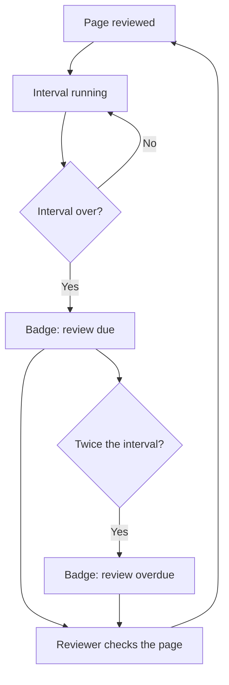

# The review cycle

Every page carries a review interval. When it runs out, the page shows a badge and appears in the dashboard widget. Nothing is deleted and nothing is hidden: the handbook simply stops pretending the page is current.

## Choosing an interval

Short intervals on pages that never change produce noise, and noise teaches people to ignore badges. Twelve months is a sensible default. Use three months only where being out of date does real damage, such as access rules.

## What a review is

Read the page and ask one question: would I write this the same way today? If yes, confirm the date and stop.
